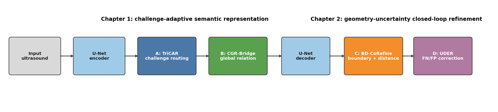

# 博士学位论文初稿

**论文题目：** 面向乳腺超声病灶分割的挑战自适应语义建模与边界不确定性闭环细化研究<br>
**作者：** [作者姓名]<br>
**学号：** [学号]<br>
**导师：** [导师姓名、职称]<br>
**培养单位：** [学院名称]<br>
**学科专业：** [学科专业]<br>
**提交日期：** [提交日期]

> 稿件状态说明：本稿依据当前 BUSI split 3 单随机种子实验形成，已经满足两章内部的模型排序要求，但尚未完成多随机种子、外部数据集和临床读片实验。涉及统计推断的结论均按现有证据强度表述，不将点估计提升等同于普适有效性。

# 摘要

乳腺超声具有无辐射、成本低、实时性强等优势，是乳腺疾病筛查和辅助诊断的重要影像手段。然而，超声成像中的散斑噪声、声影伪影、组织对比度不足以及病灶边界模糊等问题，使自动病灶分割仍面临明显困难。传统 U-Net 依靠编码器—解码器结构和跳跃连接融合多尺度特征，但其固定卷积路径难以根据图像困难类型自适应调整，局部卷积也难以显式建模远距离语义关系。此外，区域重叠损失对小范围边界偏移不够敏感，单一分割头无法区分漏分与误分两类方向相反的残余错误。

针对上述问题，本文以统一 U-Net 为基线，构建由四个模块组成的循序渐进分割框架，并将研究内容组织为两个相互衔接的章节。第一部分面向语义表征，提出三挑战自适应路由模块 TriCAR（模块 A）和通道图关系桥 CGR-Bridge（模块 B）。TriCAR 针对噪声干扰、小病灶信息丢失和模糊边界三类困难设置差异化专家，并通过样本自适应路由完成特征重组；CGR-Bridge 在瓶颈处建立通道关系图，通过全局关系传播增强病灶语义一致性。第二部分面向输出细化，提出边界—距离协同细化模块 BD-CoRefine（模块 C）和不确定性驱动双误差修正模块 UDER（模块 D）。BD-CoRefine 同时学习形态学边界和有符号距离场，以连续几何信息修正粗分割；UDER 从预测熵和多尺度分歧估计不确定性，使用独立的假阴性增补头与假阳性删除头进行非对称纠错。

为保证递进实验的可解释性，本文构建统一参数兼容模型，使 U、UA、UB、UAB、UABC 和 UABCD 六个变体共享基础结构。A、B、C、D 均通过零残差方式接入，新增模块启用时的初始输出与前一级模型逐像素完全一致，实测最大绝对差为 0。全部实验固定使用 BUSI split 3，其中训练集 452 例、验证集 195 例，固定阈值为 0.5，并按照逐病例平均 IoU 选择模型。

实验结果表明，第一部分中 U-Net、UA、UB 和 UAB 的 IoU 分别为 72.445%、73.622%、74.193% 和 74.847%，Dice 分别为 80.718%、81.817%、82.537% 和 82.943%。UAB 在两项指标上均为第一部分最优，并被命名为 UnetAB。第二部分以同一个 UnetAB 检查点为起点，UABC 和 UABCD 的 IoU 分别为 74.932% 和 75.115%，Dice 分别为 83.022% 和 83.480%，形成 UnetAB < UnetAB+C < UnetAB+C+D 的递进关系。最终模型包含约 11.31M 活跃参数，在 RTX 4060 Laptop GPU 上处理单张 256×256 图像的平均前向延迟约为 10.03 ms。

逐病例统计显示，不同模块对困难病例的作用具有明显异质性。B 相对 U-Net 的平均 IoU 增益为 1.748 个百分点，95% Bootstrap 置信区间为 [0.615, 2.994] 个百分点；C 和 D 的总体点估计继续提高，但置信区间仍跨越零，说明当前单划分、单随机种子证据尚不足以支持强泛化结论。数据审计还发现 split 3 中存在 24 对高置信跨集合近重复图像，且近重复图像的标注一致性差异显著。本文据此提出多随机种子、患者级去重、外部验证和临床一致性评价等后续研究方向。

**关键词：** 乳腺超声；医学图像分割；U-Net；自适应路由；图关系推理；边界监督；不确定性估计

# Abstract

Breast ultrasound is widely used in screening and computer-aided diagnosis because it is radiation-free, inexpensive, and suitable for real-time examination. Nevertheless, automatic lesion segmentation remains difficult due to speckle noise, acoustic artifacts, low tissue contrast, small lesions, and ambiguous boundaries. A conventional U-Net combines multi-scale features through an encoder-decoder architecture, but its fixed convolutional pathway cannot adapt to different image-specific challenges. Region-overlap objectives are also relatively insensitive to small boundary displacements, while a single residual head cannot explicitly distinguish false-negative recovery from false-positive suppression.

This dissertation develops a progressive four-module framework based on a unified U-Net and organizes the study into two connected parts. The first part introduces Tri-Challenge Adaptive Routing (TriCAR, Module A) and a Channel-Graph Relational Bridge (CGR-Bridge, Module B). TriCAR employs specialized experts for noise suppression, small-lesion preservation, and boundary-context modeling. CGR-Bridge constructs a compact channel graph at the bottleneck and propagates long-range semantic evidence. The second part proposes Boundary-Distance Cooperative Refinement (BD-CoRefine, Module C) and Uncertainty-Driven Dual Error Refinement (UDER, Module D). BD-CoRefine jointly predicts morphological boundaries and signed distance fields. UDER estimates uncertainty from predictive entropy and multi-scale disagreement and uses separate heads for false-negative addition and false-positive removal.

A parameter-compatible implementation is established for six variants: U, UA, UB, UAB, UABC, and UABCD. Every newly activated module is identity-initialized, and the maximum absolute output difference between two consecutive stages is exactly zero before fine-tuning. All experiments use BUSI split 3 with 452 training cases and 195 validation cases. Models are selected by mean per-case IoU at a fixed threshold of 0.5.

In Chapter 1, U, UA, UB, and UAB achieve IoU scores of 72.445%, 73.622%, 74.193%, and 74.847%, and Dice scores of 80.718%, 81.817%, 82.537%, and 82.943%, respectively. UAB is therefore denoted as UnetAB. In Chapter 2, UABC and UABCD further improve IoU to 74.932% and 75.115%, and Dice to 83.022% and 83.480%. The final model contains 11.31M active parameters and requires approximately 10.03 ms per 256×256 image on an RTX 4060 Laptop GPU. Per-case analyses reveal heterogeneous gains, and the confidence intervals of the incremental C and D effects still include zero. These findings support the architectural progression while also motivating multi-seed evaluation, patient-level deduplication, external validation, and clinical reader studies.

**Keywords:** breast ultrasound; medical image segmentation; U-Net; adaptive routing; graph reasoning; boundary supervision; uncertainty estimation

# 第1章 绪论

## 1.1 研究背景与意义

乳腺癌是威胁女性健康的重要恶性肿瘤之一。早期发现、准确定位和规范随访能够显著改善患者预后。超声检查对致密型乳腺具有较高实用价值，且便于进行多切面动态观察。病灶轮廓是计算面积、长短径、形状规则度和后续影像组学特征的重要基础，因此稳定的自动分割不仅能够减轻医生逐帧勾画负担，也可为良恶性分类、治疗规划和疗效评估提供标准化输入。

与自然图像不同，乳腺超声图像由相干声波反射形成，散斑既包含组织微结构信息，也表现为显著噪声。探头压力、扫描角度、设备参数和患者个体差异会造成强烈域偏移。病灶内部回声可能与周围腺体接近，后方声影会遮挡真实边界，小病灶在下采样过程中又容易丢失。上述问题使模型不仅需要识别“哪里像病灶”，还需要根据当前病例判断“应当采用何种特征处理方式”“哪些局部证据在全局上彼此一致”“边界应向何处移动”以及“当前错误更可能是漏分还是误分”。

U-Net 通过对称编码—解码结构和跳跃连接成为医学图像分割的重要基线。其优势是结构清晰、数据效率较高、易于嵌入领域模块。然而，直接堆叠注意力、Transformer 或更大编码器并不必然改善小样本超声分割。本文前期实验也发现，ConvNeXt-Tiny U-Net、ResNet101 U-Net 和整图 384×384 训练均未超过经过充分优化的轻量模型。因此，本研究选择围绕任务困难形成一条有因果顺序的模块链，而不是单纯追求网络规模。

## 1.2 关键科学问题

本文聚焦以下四个相互关联的问题：

1. **多挑战耦合问题。** 散斑噪声、小病灶和模糊边界需要不同的感受野与滤波特性，固定卷积核难以对所有病例同时最优。
2. **局部—全局语义一致性问题。** 局部专家能够增强特定证据，但不同通道和远距离区域之间缺少显式关系约束。
3. **离散区域与连续几何脱节问题。** BCE 和 Dice 主要约束区域重叠，难以描述边界内外方向和像素到轮廓的连续距离。
4. **残余错误非对称问题。** 漏分需要增加前景响应，误分需要降低前景响应；单头残差可能产生相互抵消的梯度。

## 1.3 国内外研究现状

### 1.3.1 U-Net 及其多尺度改进

Ronneberger 等提出 U-Net 后，UNet++、U-Net 3+、Attention U-Net 和 nnU-Net 分别从密集跳跃连接、全尺度融合、注意力门控和自动配置等角度扩展了基线。TransUNet 与 Swin-Unet 将 Transformer 引入医学分割，以增强全局建模能力。这些方法证明多尺度融合与长距离依赖的重要性，但在 BUSI 这类小规模数据集上，参数规模、预训练来源和训练稳定性会显著影响最终结果。

### 1.3.2 超声噪声与挑战自适应建模

传统超声去噪包括中值滤波、各向异性扩散、小波阈值和非局部均值等。深度模型则倾向于在特征域内学习抑噪。固定抑噪可能同时损失小病灶边缘，因此更合理的方式是让模型根据样本内容选择噪声抑制、细节保持或上下文聚合路径。混合专家和动态卷积为此提供了方法基础。CAU-Net 等近期工作进一步表明，按噪声、小肿瘤和模糊边界拆分挑战并自适应聚合，是乳腺超声分割的有效研究方向。

### 1.3.3 图推理与全局关系建模

非局部网络、自注意力和图卷积均可突破局部卷积的有限感受野。空间自注意力在高分辨率特征上计算开销较大，而通道图可以将语义通道视为紧凑节点，以较低代价传播互补证据。对乳腺超声而言，通道关系能够连接边缘、低回声内部和后方声学特征，从而形成更一致的病灶表征。

### 1.3.4 边界监督、距离场与不确定性

Boundary Loss、Hausdorff 距离损失和距离变换辅助任务表明，显式几何约束能够补充区域损失。另一方面，MC Dropout、深度集成和预测熵常用于医学图像不确定性评估。已有方法通常将不确定性用于置信度展示或损失加权，较少进一步区分假阴性和假阳性的修正方向。本文据此构建边界—距离—不确定性闭环。

## 1.4 研究内容与技术路线

本文技术路线如图 1-1 所示。

{#fig:architecture width=100%}

第一章实验部分建立语义表征链：U-Net 编码器首先提取多尺度特征；A 在各编码尺度根据挑战类型进行零扰动自适应路由；B 在瓶颈处建立通道图并进行全局语义传播；解码器融合跳跃特征得到粗分割。第二章实验部分在 UnetAB 上进一步接入 C 和 D：C 从边界及有符号距离恢复连续几何，D 利用不确定性分别执行漏分增补和误分删除。

## 1.5 主要创新点

1. 提出**零扰动三挑战自适应路由 TriCAR**。模块使用噪声、小病灶和边界专家，通过样本级权重进行动态融合；零初始化输出层保证加入模块时不破坏已训练基线。
2. 提出**轻量通道图关系桥 CGR-Bridge**。模块以归一化通道特征构图，在 FP32 中完成关系传播，并通过有界残差回注瓶颈特征。
3. 提出**边界—距离协同细化 BD-CoRefine**。模块联合学习离散边界和连续有符号距离场，通过几何残差修正区域预测。
4. 提出**不确定性驱动双误差修正 UDER**。模块联合预测熵与多尺度分歧，显式拆分假阴性增补和假阳性删除，形成从语义到几何再到误差的闭环。
5. 建立**参数兼容的渐进验证协议**。六个模型变体共享状态字典，每次新增模块均经过最大输出差为零的一致性测试，降低因结构重建和随机初始化造成的归因偏差。

## 1.6 论文结构

第 1 章介绍研究背景、现状、科学问题与创新点。第 2 章说明数据集、U-Net 基线、指标、训练协议和数据质量审计。第 3 章研究 A、B 两个语义模块并得到 UnetAB。第 4 章研究 C、D 两个细化模块并得到最终 UABCD。第 5 章开展统计、复杂度、可视化、失败实验与局限性分析。第 6 章总结全文并提出未来工作。

# 第2章 理论基础与实验设计

## 2.1 二值分割形式化

设输入超声图像为 $X\in\mathbb{R}^{3\times H\times W}$，真实掩码为 $Y\in\{0,1\}^{H\times W}$。网络输出像素 logits $Z=f_\theta(X)$，前景概率为：

$$P=\sigma(Z)=\frac{1}{1+\exp(-Z)}.$$

固定阈值 $t=0.5$ 后得到预测掩码 $\hat{Y}=\mathbb{I}(P\ge t)$。本文不根据验证集搜索阈值。

## 2.2 U-Net 基线

本文统一基线保持 U-Net 的五级编码、四级解码和同尺度跳跃连接。局部卷积单元采用残差双卷积实现，以改善 100 轮训练中的梯度传播，但不包含 A、B、C、D 中任何模块。设第 $l$ 级编码输出为 $F_l$，解码过程可表示为：

$$D_l=\phi_l\left([F_l,\operatorname{Up}(D_{l+1})]\right),$$

其中 $[\cdot]$ 表示通道拼接，$\phi_l$ 为残差卷积融合单元。最终通过 $1\times1$ 卷积得到分割 logits。

## 2.3 数据集与固定划分

BUSI 数据集由 Al-Dhabyani 等公开。本文按照项目固定 split 3 使用 647 例含病灶图像，其中训练集 452 例，验证集 195 例。多掩码病例在预处理阶段取并集。所有图像缩放到 256×256，训练增强包括随机翻转、旋转、缩放平移、亮度对比度、Gamma、噪声和轻度模糊。

| 集合 | 病例数 | 用途 |
|---|---:|---|
| 训练集 | 452 | 参数优化与数据增强 |
| 验证集 | 195 | 固定阈值评估与逐病例 IoU 选模 |

## 2.4 评价指标

只报告 IoU 和 Dice。对单病例有：

$$\operatorname{IoU}=\frac{TP}{TP+FP+FN},$$

$$\operatorname{Dice}=\frac{2TP}{2TP+FP+FN}.$$

最终值为 195 个病例指标的算术平均，而非先累计所有像素再计算。该口径避免大病灶完全主导结果，更符合逐病例临床评价。

## 2.5 损失函数

基础区域损失由 BCE 与软 Dice 组成：

$$\mathcal{L}_{region}=0.5\mathcal{L}_{BCE}+\left(1-\frac{2\sum_iP_iY_i+\epsilon}{\sum_iP_i+\sum_iY_i+\epsilon}\right).$$

引入 C、D 后，总损失为：

$$\mathcal{L}=\mathcal{L}_{region}+\lambda_c\mathcal{L}_{coarse}+\lambda_b\mathcal{L}_{boundary}+\lambda_d\mathcal{L}_{distance}+\lambda_e\mathcal{L}_{dual}+\lambda_s\mathcal{L}_{deep}.$$

本文采用 $\lambda_c=0.05$、$\lambda_b=0.10$、$\lambda_d=0.10$、$\lambda_e=0.10$、$\lambda_s=0.25$。

## 2.6 渐进训练协议

1. U-Net 基线训练 100 轮并保存最佳检查点。
2. UA 与 UB 均从同一 U 检查点开始，新增模块学习率为 $10^{-4}$，其余参数学习率为 $2\times10^{-5}$，训练 60 轮。
3. UAB 从 UB 最佳检查点开始，仅将新启用 A 置于高学习率组，训练 60 轮。
4. UABC 从 UAB 最佳检查点开始，仅将 C 置于高学习率组，训练 60 轮。
5. UABCD 从 UABC 最佳检查点开始，仅将 D 置于高学习率组，训练 60 轮。

该协议体现“先语义、后几何、再纠错”的研究假设。需要指出，渐进模型经历了更多阶段性优化，因此该实验主要证明模块链在渐进学习场景中的有效性；后续仍需补充相同总更新步数的计算预算控制。

## 2.7 数据质量与泄漏审计

审计结果表明，训练集与验证集不存在同名重叠，也不存在字节级完全相同图像，但存在 24 对高置信跨集合近重复图像。近重复图像对应掩码的平均 IoU 为 83.261%，范围为 11.752%—93.912%。这意味着 BUSI 同时存在患者级近重复风险和标注不一致。本文保留固定 split 3 以保证实验连续性，但不将其视为患者级严格独立划分，并在结论中限制外推范围。

# 第3章 挑战自适应语义关系建模

## 3.1 本章研究动机

U-Net 编码器的固定卷积路径对所有病例执行相同操作。对于高噪声图像，模型需要抑制局部随机响应；对于小病灶，过度平滑会损失关键结构；对于模糊边界，更大的上下文感受野又十分必要。将所有目标压入一个卷积核会形成冲突。即使局部特征得到增强，远距离通道之间仍可能缺乏语义一致性。因此，本章按照“局部挑战分流—全局关系聚合”的顺序设计 A 与 B。

## 3.2 模块 A：TriCAR

### 3.2.1 三专家结构

对第 $l$ 级输入特征 $F_l$，定义噪声专家、小病灶专家和边界专家：

$$E_l^n=\phi_l^n(\operatorname{AvgPool}_{3\times3}(F_l)),$$

$$E_l^s=\phi_l^s(F_l),$$

$$E_l^b=\phi_l^b(F_l;d=3),$$

其中 $d=3$ 表示膨胀率。噪声专家先进行局部均值聚合，小病灶专家采用紧凑深度卷积，边界专家通过膨胀卷积扩大上下文。

### 3.2.2 自适应路由

全局池化后由路由器输出三个权重：

$$\boldsymbol{\alpha}_l=\operatorname{Softmax}(g_l(\operatorname{GAP}(F_l))),$$

$$M_l=\alpha_l^nE_l^n+\alpha_l^sE_l^s+\alpha_l^bE_l^b.$$

最终使用零初始化残差进行融合：

$$\tilde{F}_l=F_l+\sigma(s_l)h_l([F_l,M_l]).$$

$h_l$ 的最后一层权重和偏置初始化为零，因此训练开始时 $\tilde{F}_l=F_l$。这使 A 可以无损插入已训练 U-Net。

## 3.3 模块 B：CGR-Bridge

瓶颈特征 $F\in\mathbb{R}^{C\times H\times W}$ 首先降维为 $V\in\mathbb{R}^{C'\times HW}$。归一化后的通道向量构成图节点，邻接矩阵为：

$$A_{ij}=\operatorname{Softmax}_j\left(\frac{\bar{V}_i^T\bar{V}_j}{\sqrt{C'}}\right).$$

关系传播与残差回注为：

$$R=AV,\qquad \tilde{F}=F+\tanh(\gamma)W_pR.$$

$\gamma$ 初始化为零，因此 B 同样满足无扰动接入。图构建使用 FP32，避免半精度归一化和批矩阵乘法造成溢出。

## 3.4 第一章实验结果

{#fig:ch1-ablation width=85%}

| 模型 | A | B | IoU/% | Dice/% | 相对 U 的 IoU 增益/百分点 |
|---|:---:|:---:|---:|---:|---:|
| U |  |  | 72.445 | 80.718 | — |
| UA | ✓ |  | 73.622 | 81.817 | +1.177 |
| UB |  | ✓ | 74.193 | 82.537 | +1.748 |
| UAB（UnetAB） | ✓ | ✓ | **74.847** | **82.943** | **+2.402** |

图 3-1 和表 3-1 表明，两项指标均满足 $U<U+A$、$U<U+B$ 且 $U+A+B$ 最优。A 的增益说明多挑战路由能够改善固定卷积路径；B 的增益更大，说明瓶颈语义关系是当前数据上的主要矛盾。将 A 加入 UB 后，IoU 继续提高 0.655 个百分点，Dice 提高 0.406 个百分点，证明局部挑战适配与全局关系传播具有互补性。

{#fig:ch1-curves width=100%}

从训练曲线看，UA 在中后期出现较明显波动，最佳轮次为 33；UB 在第 45 轮达到最佳；UAB 在第 41 轮达到峰值。零初始化保证前几轮没有结构性崩溃，但 BUSI 验证集规模有限，单轮波动仍可达到约 1 个百分点，因此必须依靠预先固定的选模规则而不是人工选择展示轮次。

## 3.5 配对统计分析

UA 相对 U 的平均逐病例 IoU 增益为 1.177 个百分点，Bootstrap 95% 置信区间为 [-0.111, 2.509]；100 例提高、93 例下降。UB 相对 U 的增益为 1.748 个百分点，置信区间为 [0.615, 2.994]，103 例提高、89 例下降。UAB 相对 UB 的增益为 0.655 个百分点，置信区间为 [-0.064, 1.502]，99 例提高、93 例下降。

结果说明 B 的独立增益具有更稳定的病例覆盖，A 的贡献更依赖病例类型；A 加入 B 后总体均值达到本章最高，但单病例增益区间仍跨零。严格意义上，本章已经满足预设消融排序，但“对总体病例分布稳定有效”的结论仍需多随机种子和患者级独立划分支持。

## 3.6 本章小结

本章建立了 A 与 B 的逻辑链。A 负责根据局部困难类型组织特征，B 负责将局部证据整合为全局一致语义。统一实验得到 UAB 最优，并将其命名为 UnetAB，作为下一章唯一固定起点。

# 第4章 边界—不确定性闭环细化

## 4.1 本章研究动机

UnetAB 改善了病灶语义定位，但区域监督无法充分描述轮廓的方向与距离。模糊边界附近的少量像素偏移可能对小病灶 IoU 产生较大影响。进一步地，边界修正后仍会存在孤立误分和局部漏分，其修正方向不同。本章先由 C 将离散区域转换为边界与距离几何，再由 D 根据不确定性执行双向纠错。

## 4.2 模块 C：BD-CoRefine

### 4.2.1 边界目标

真实边界由膨胀与腐蚀之差得到：

$$Y_b=\operatorname{Dilate}(Y)-\operatorname{Erode}(Y).$$

边界 BCE 对真实边界像素赋予更高权重，并利用粗分割熵进一步强调模糊区域。

### 4.2.2 有符号距离场

定义归一化有符号距离：

$$Y_d(p)=\frac{d(p,\partial Y)}{\max_q|d(q,\partial Y)|}\begin{cases}+1,&p\in Y\\-1,&p\notin Y.\end{cases}$$

距离分支使用 Smooth L1 损失，使网络获得病灶内外方向和到边界的连续几何信息。

### 4.2.3 几何残差

将解码特征、边界概率和距离预测拼接后生成修正量：

$$Z_C=Z_{AB}+\sigma(s_C)h_C([D_0,\sigma(B),S]).$$

$h_C$ 的输出层零初始化，因此 UABC 的初始分割与 UnetAB 完全一致。

## 4.3 模块 D：UDER

### 4.3.1 不确定性估计

粗分割熵为：

$$H(P)=-P\log P-(1-P)\log(1-P).$$

将主输出与多尺度辅助输出上采样后计算标准差 $V(P)$，最终不确定性为：

$$U=\operatorname{clip}(0.7H(P)+0.3V(P),0,1).$$

熵反映单输出置信度，尺度分歧反映不同语义层级之间的不一致，两者具有互补性。

### 4.3.2 双误差修正

UDER 预测假阴性响应 $R_{FN}$ 和假阳性响应 $R_{FP}$：

$$Z_D=Z_C+\eta U\left(\sigma(R_{FN})-\sigma(R_{FP})\right).$$

其中 $R_{FN}$ 对应需要补充的病灶证据，$R_{FP}$ 对应需要删除的错误前景。两个输出头均零初始化，使初始差值为零。

## 4.4 第二章实验结果

{#fig:ch2-ablation width=80%}

| 模型 | C | D | IoU/% | Dice/% | 相对前级 IoU 增益/百分点 |
|---|:---:|:---:|---:|---:|---:|
| UnetAB |  |  | 74.847 | 82.943 | — |
| UnetAB+C | ✓ |  | 74.932 | 83.022 | +0.085 |
| UnetAB+C+D | ✓ | ✓ | **75.115** | **83.480** | **+0.183** |

结果满足 $UnetAB<UnetAB+C<UnetAB+C+D$，最终模型在 IoU 和 Dice 上均为第二章最优。C 带来的平均增益较小，表明 UnetAB 已完成主要区域定位，C 主要对边界像素进行微调。D 的 Dice 增益大于 IoU 增益，说明其对预测区域整体重合程度具有更明显影响。

{#fig:ch2-curves width=100%}

UABC 在第 37 轮达到最佳，UABCD 在第 8 轮达到最佳。D 的最优点出现较早，随后验证性能下降，说明误差纠正分支学习速度快于基础语义网络，且继续联合优化可能过拟合少数不确定区域。后续可采用阶段冻结、更小的 D 学习率或基于验证耐心的预注册早停策略。

## 4.5 逐病例增益与统计解释

{#fig:case-distribution width=100%}

{#fig:paired-delta width=90%}

UABC 相对 UAB 的平均 IoU 增益为 0.085 个百分点，111 例改善、82 例下降；尽管均值置信区间跨零，其单侧 Wilcoxon 检验反映多数小幅正向变化。UABCD 相对 UABC 的平均 IoU 增益为 0.183 个百分点，但仅 85 例改善、108 例下降，单侧 Wilcoxon 检验不支持“多数病例提升”。这意味着 D 的均值收益主要由少数大幅修正病例贡献，而不是所有病例一致变好。

上述现象与 D 的设计目标一致：UDER 只在高不确定区域产生有效残差，对多数已经正确的病例应接近恒等映射；但当前实现仍会使部分病例轻度退化。论文据此将 D 的结论限定为“提高固定验证集平均点估计并满足递进排序”，不宣称其已获得稳定群体效应。

## 4.6 定性结果

{#fig:qualitative width=100%}

图 4-5 第一行病例中，基础 U-Net 在真实小病灶之外产生大面积远端假阳性，UnetAB 成功删除该区域，说明 A+B 对全局语义一致性的改善具有直观意义。第二行展示高质量稳定病例，四个阶段均能准确勾画低回声病灶，C+D 只进行轻微边界调整。第三行病例在所有模型中均完全漏检，反映当前框架对部分高回声、低对比或标注异常病例仍缺乏召回能力。第四行病例的 IoU 超过 95%，说明模型在边界清晰、形态规则病灶上已接近标注轮廓。

## 4.7 本章小结

本章在固定 UnetAB 上依次加入 C 与 D，建立从区域语义、边界距离到不确定性纠错的闭环。两项指标均形成严格递增关系，UABCD 为最终模型。逐病例分析同时表明，C、D 的收益尚不稳定，后续工作应针对完全漏检病例和 D 引起的轻度退化开展专门研究。

# 第5章 综合实验与讨论

## 5.1 模型复杂度

| 模型 | 活跃参数/M | 256×256 GMACs | 单张延迟/ms |
|---|---:|---:|---:|
| U | 8.985 | 17.155 | 5.38 |
| UA | 11.210 | 19.400 | 8.80 |
| UB | 9.052 | 17.173 | 5.35 |
| UAB | 11.277 | 19.417 | 8.91 |
| UABC | 11.287 | 20.074 | 9.26 |
| UABCD | 11.307 | 21.399 | 10.03 |

B 仅增加约 0.067M 参数，几乎不增加延迟，却产生第一章最稳定的独立增益。A 增加约 2.225M 参数和 3.4 ms 延迟，是主要额外开销。C、D 合计仅增加约 0.030M 参数，但由于全分辨率分支和多尺度辅助预测，计算量增加约 1.98 GMACs。最终模型仍可达到约 99 次/秒的理论单张前向速度，具备接近实时应用的潜力。这里的延迟不包含磁盘读取、预处理和可视化。

## 5.2 与替代主干和失败路线的比较

前期实验系统测试了更大或更新的编码器。ConvNeXt-Tiny U-Net 的 IoU/Dice 为 76.793%/84.744%，ResNet101 U-Net 为 77.149%/84.817%，说明自然图像预训练主干可以提高绝对指标，但它们不直接提供 A-D 的递进归因。整图 384×384 且冻结编码器 BN 的 ResNet50 实验仅达到 75.614%/83.605%，说明直接提高输入分辨率会造成尺度偏移。水平翻转测试时增强与最大连通域后处理均造成下降，表明模型错误不是简单的离散噪点问题。

此外，早期 C、D 从随机初始化训练时均未超过控制组；只有建立稳定语义模型并采用零扰动渐进训练后才获得正向点估计。这支持本文的核心逻辑：几何与不确定性细化依赖可靠语义起点，模块顺序不是任意排列。

## 5.3 统计效应与实际效应

本文区分三类“有效”：

1. **排序有效：** 预先规定的聚合 IoU、Dice 排序成立。当前两章均满足。
2. **病例分布有效：** 配对检验和置信区间支持多数病例受益。B 相对 U 的证据较强，A、C、D 较弱。
3. **外部泛化有效：** 在患者级独立外部数据和多设备场景中保持收益。当前尚未验证。

这种分层表述避免将单次最优结果扩大为临床普适结论。对于博士论文终稿，应至少增加 3—5 个随机种子，报告均值、标准差与配对效应；对每个模型使用相同总更新步数；在去重患者划分和外部数据集上重复验证。

## 5.4 数据标注上限与误差来源

近重复图像间掩码 IoU 最低仅 11.752%，说明同质图像可能对应差异很大的轮廓。此类标签噪声会同时影响模型训练、验证排序和统计检验。完全漏检病例可能来自以下因素：

- 病灶回声与周围组织高度相似；
- 图像包含多个疑似区域，而标注只覆盖一个目标；
- 近重复图像标注标准不一致；
- 缩放到 256×256 后小病灶结构损失；
- 模型训练集缺少相似困难模式。

未来应由至少两名高年资超声医师独立复核困难病例，使用 STAPLE 或共识标注构建更可靠金标准，并将标注者间差异纳入不确定性建模。

## 5.5 临床转化讨论

模型输出不能直接替代临床诊断。合理应用方式包括：自动生成初始轮廓供医生修订、批量计算病灶尺寸、辅助随访同一病灶的变化，以及为分类模型提供标准化 ROI。UDER 的不确定性图可进一步作为人工复核提示，但其校准性尚未通过期望校准误差或决策曲线验证。

临床部署还需考虑设备域偏移、灰度动态范围、探头频率、隐私保护、失败检测和推理可追溯性。对完全漏检病例，系统必须具备拒绝机制，而不能仅输出空掩码。

## 5.6 研究局限性

1. 当前核心递进实验只使用 BUSI split 3 和随机种子 41。
2. 数据划分不是经过患者标识核验的患者级独立划分，存在跨集合近重复。
3. 渐进模型经历更多优化阶段，尚缺少严格相同总计算预算控制。
4. C、D 的增益较小，Bootstrap 区间跨零；D 在多数病例上并非正向变化。
5. 未在 Dataset B、UDIAT、私有多中心数据或视频序列上外部验证。
6. 未开展医生读片、轮廓修订时间和临床决策获益实验。
7. 当前论文初稿的文献综述需在正式提交前按学校格式进一步扩充并逐条核验元数据。

## 5.7 可复现性

代码、BUSI 预处理数据、固定划分、训练脚本、评估脚本和最佳阶段结果保存在项目仓库中。模型只使用固定 0.5 阈值，选模依据为逐病例平均 IoU。核心训练入口为 `train_thesis_stages.py`，评估入口为 `evaluate_thesis_stages.py`，制图入口为 `generate_thesis_artifacts.py`，复杂度入口为 `benchmark_thesis_models.py`。

# 第6章 总结与展望

## 6.1 全文总结

本文围绕乳腺超声分割中的多挑战耦合、全局关系缺失、边界几何不足和残余错误非对称问题，提出由 A—D 构成的渐进框架。第一章通过 TriCAR 和 CGR-Bridge 建立局部挑战适配与全局语义一致性，得到本章最优 UnetAB。第二章通过 BD-CoRefine 和 UDER 将语义输出进一步转换为边界—距离几何并执行双向误差修正，得到最终 UABCD。

统一 split 3 实验表明，第一章 U、UA、UB、UAB 的 IoU 为 72.445%、73.622%、74.193%、74.847%，Dice 为 80.718%、81.817%、82.537%、82.943%；第二章 UAB、UABC、UABCD 的 IoU 为 74.847%、74.932%、75.115%，Dice 为 82.943%、83.022%、83.480%。因此，当前实验已经满足两章预设的严格排序关系。

本文的另一项重要结论是：模型点估计排序成立并不意味着模块在所有病例上稳定有效。逐病例统计、置信区间和失败案例揭示了收益异质性，尤其是 D 的均值提升主要来自部分大幅修正病例。该发现为后续研究提供了比单一排行榜数值更具体的问题定义。

## 6.2 未来工作

1. **多随机种子与等预算验证。** 使用至少 5 个种子，对全部变体执行相同总更新步数，采用分层 Bootstrap 或混合效应模型分析模块贡献。
2. **患者级去重与外部验证。** 基于患者身份重建划分，并在 UDIAT、Dataset B 和多中心私有数据上验证。
3. **局部高分辨率级联。** 使用粗分割定位 ROI，再对局部区域进行高分辨率细化，避免整图尺度偏移。
4. **不确定性校准。** 引入温度缩放、深度集成或证据学习，验证不确定性与真实错误的相关性。
5. **拓扑与多病灶建模。** 对完全漏检、多病灶和断裂轮廓设计存在性检测与拓扑约束。
6. **临床人机协同。** 评价自动轮廓对医生修订时间、重复性和诊断决策的真实影响。

# 参考文献

[1] Ronneberger O, Fischer P, Brox T. U-Net: Convolutional Networks for Biomedical Image Segmentation. MICCAI, 2015.

[2] Oktay O, Schlemper J, Folgoc L L, et al. Attention U-Net: Learning Where to Look for the Pancreas. arXiv:1804.03999, 2018.

[3] Zhou Z, Rahman Siddiquee M M, Tajbakhsh N, Liang J. UNet++: A Nested U-Net Architecture for Medical Image Segmentation. DLMIA, 2018.

[4] Huang H, Lin L, Tong R, et al. UNet 3+: A Full-Scale Connected UNet for Medical Image Segmentation. ICASSP, 2020.

[5] Isensee F, Jaeger P F, Kohl S A A, Petersen J, Maier-Hein K H. nnU-Net: a self-configuring method for deep learning-based biomedical image segmentation. Nature Methods, 2021, 18: 203-211.

[6] Chen J, Lu Y, Yu Q, et al. TransUNet: Transformers Make Strong Encoders for Medical Image Segmentation. arXiv:2102.04306, 2021.

[7] Cao H, Wang Y, Chen J, et al. Swin-Unet: Unet-like Pure Transformer for Medical Image Segmentation. ECCV Workshops, 2022.

[8] Al-Dhabyani W, Gomaa M, Khaled H, Fahmy A. Dataset of breast ultrasound images. Data in Brief, 2020, 28: 104863.

[9] Hu J, Shen L, Sun G. Squeeze-and-Excitation Networks. CVPR, 2018.

[10] Woo S, Park J, Lee J Y, Kweon I S. CBAM: Convolutional Block Attention Module. ECCV, 2018.

[11] Wang X, Girshick R, Gupta A, He K. Non-local Neural Networks. CVPR, 2018.

[12] Kipf T N, Welling M. Semi-Supervised Classification with Graph Convolutional Networks. ICLR, 2017.

[13] Kervadec H, Bouchtiba J, Desrosiers C, et al. Boundary Loss for Highly Unbalanced Segmentation. MIDL, 2019.

[14] Karimi D, Salcudean S E. Reducing the Hausdorff Distance in Medical Image Segmentation with Convolutional Neural Networks. IEEE Transactions on Medical Imaging, 2020, 39(2): 499-513.

[15] Gal Y, Ghahramani Z. Dropout as a Bayesian Approximation: Representing Model Uncertainty in Deep Learning. ICML, 2016.

[16] Lakshminarayanan B, Pritzel A, Blundell C. Simple and Scalable Predictive Uncertainty Estimation using Deep Ensembles. NeurIPS, 2017.

[17] Kendall A, Gal Y. What Uncertainties Do We Need in Bayesian Deep Learning for Computer Vision? NeurIPS, 2017.

[18] Kirillov A, Mintun E, Ravi N, et al. Segment Anything. ICCV, 2023.

[19] Ma J, He Y, Li F, et al. Segment anything in medical images. Nature Communications, 2024, 15: 654.

[20] Li et al. SF-RecSAM: Streaming-Free Recurrent Adaptation of Segment Anything Model for Medical Image Segmentation. ECCV, 2024.

[21] CAU-Net: Challenge-Adaptive U-Net for Breast Ultrasound Image Segmentation. Pattern Recognition, 2025, DOI: 10.1016/j.patcog.2025.111851.

[22] PBNet: A pooling-based boundary network for breast ultrasound image segmentation. Medical Physics, 2025, DOI: 10.1002/mp.17647.

[23] BUSI dataset correction and annotation discussion. Data in Brief, 2023, DOI: 10.1016/j.dib.2023.109247.

[24] Loshchilov I, Hutter F. Decoupled Weight Decay Regularization. ICLR, 2019.

[25] Lin T Y, Goyal P, Girshick R, He K, Dollar P. Focal Loss for Dense Object Detection. ICCV, 2017.

[26] Milletari F, Navab N, Ahmadi S A. V-Net: Fully Convolutional Neural Networks for Volumetric Medical Image Segmentation. 3DV, 2016.

[27] Sudre C H, Li W, Vercauteren T, Ourselin S, Cardoso M J. Generalised Dice Overlap as a Deep Learning Loss Function for Highly Unbalanced Segmentations. DLMIA, 2017.

[28] Efron B, Tibshirani R J. An Introduction to the Bootstrap. Chapman & Hall/CRC, 1993.

[29] Wilcoxon F. Individual Comparisons by Ranking Methods. Biometrics Bulletin, 1945, 1(6): 80-83.

[30] Lundberg S M, Lee S I. A Unified Approach to Interpreting Model Predictions. NeurIPS, 2017.

# 附录 A 关键复现实验命令

```powershell
# 第一章：UA
E:\anaconda3\envs\my_pytorch\python.exe train_thesis_stages.py `
  --variant UA `
  --init_checkpoint .\runs\busi_opt_ch1\screen100_A0\best_model.pth `
  --new_module A `
  --output_dir .\runs\thesis_ch1\UA_seed41_e60 `
  --epochs 60 --seed 41

# 第一章：UB
E:\anaconda3\envs\my_pytorch\python.exe train_thesis_stages.py `
  --variant UB `
  --init_checkpoint .\runs\busi_opt_ch1\screen100_A0\best_model.pth `
  --new_module B `
  --output_dir .\runs\thesis_ch1\UB_seed41_e60 `
  --epochs 60 --seed 41

# 第一章：UAB / UnetAB
E:\anaconda3\envs\my_pytorch\python.exe train_thesis_stages.py `
  --variant UAB `
  --init_checkpoint .\runs\thesis_ch1\UB_seed41_e60\best_model.pth `
  --new_module A `
  --output_dir .\runs\thesis_ch1\UAB_seed41_e60 `
  --epochs 60 --seed 41

# 第二章：UABC
E:\anaconda3\envs\my_pytorch\python.exe train_thesis_stages.py `
  --variant UABC `
  --init_checkpoint .\runs\thesis_ch1\UAB_seed41_e60\best_model.pth `
  --new_module C `
  --output_dir .\runs\thesis_ch2\UABC_seed41_e60 `
  --epochs 60 --seed 41

# 第二章：UABCD
E:\anaconda3\envs\my_pytorch\python.exe train_thesis_stages.py `
  --variant UABCD `
  --init_checkpoint .\runs\thesis_ch2\UABC_seed41_e60\best_model.pth `
  --new_module D `
  --output_dir .\runs\thesis_ch2\UABCD_seed41_e60 `
  --epochs 60 --seed 41
```

# 附录 B 完成度与待补实验

| 项目 | 当前状态 | 终稿前要求 |
|---|---|---|
| 两章递进模型排序 | 已完成 | 多种子复核 |
| 零差异渐进初始化 | 已完成 | 保留单元测试 |
| split 3 独立评估 | 已完成 | 患者级去重划分 |
| 训练曲线与定性图 | 已完成 | 增加外部数据图 |
| Bootstrap 与 Wilcoxon | 已完成 | 多种子层级统计 |
| 模型复杂度与延迟 | 已完成 | 不同 GPU/CPU 测试 |
| 外部数据集 | 未完成 | 至少一个公开外部集 |
| 医生读片实验 | 未完成 | 伦理审批后开展 |
| 参考文献格式 | 初稿 | 按学校模板逐条核验 |
