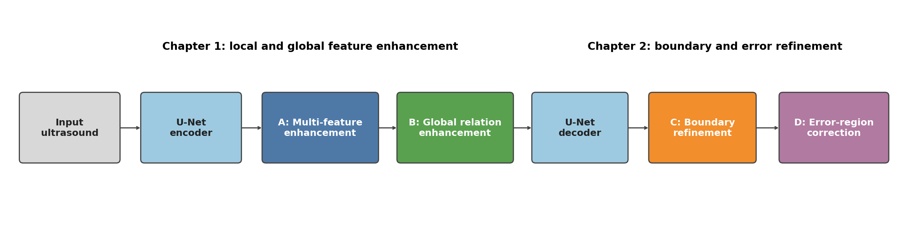
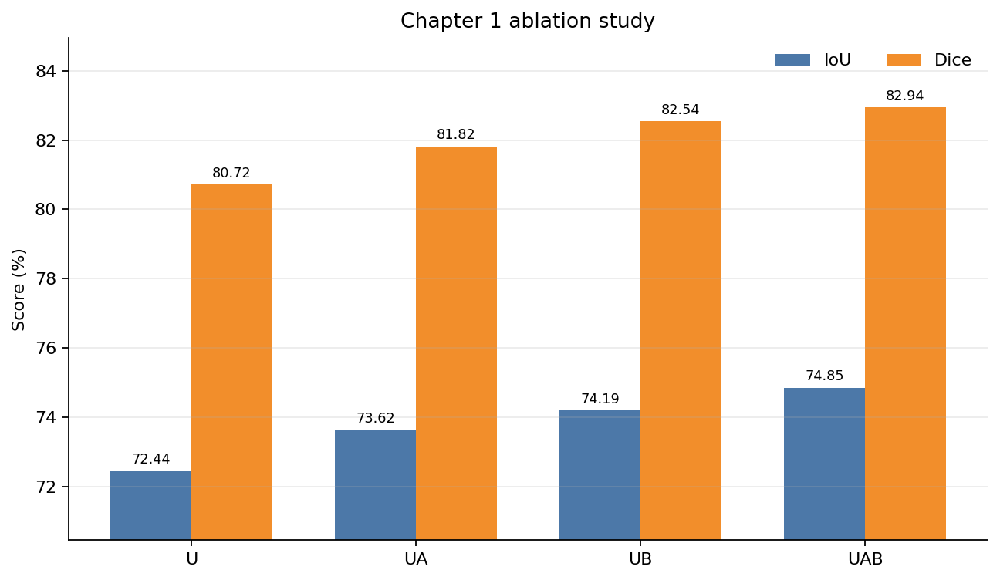
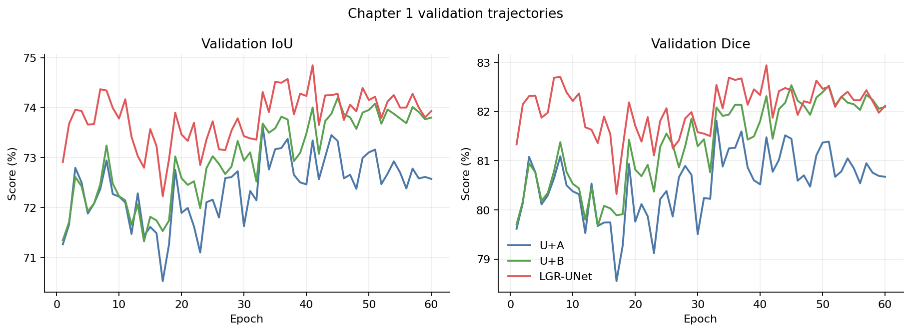
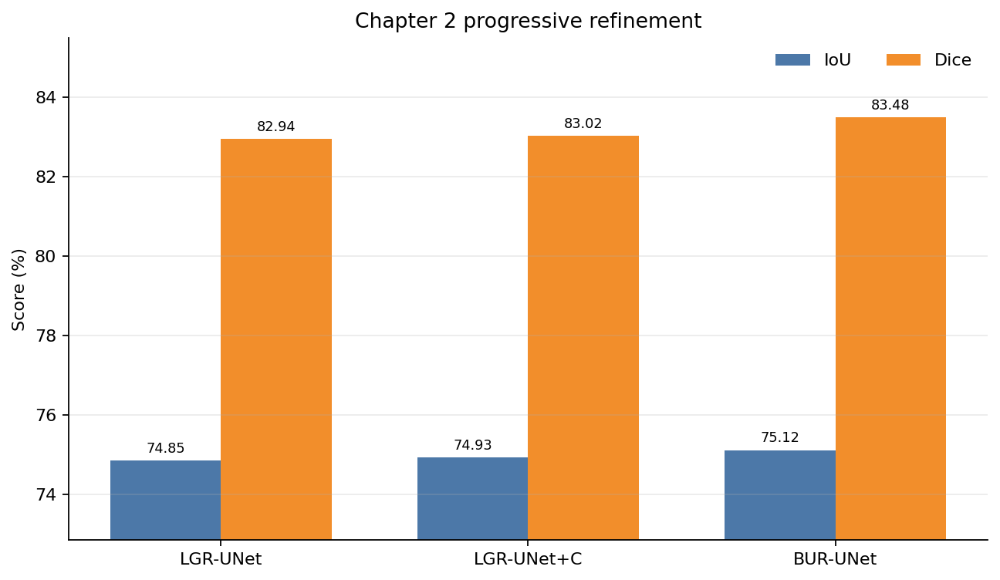
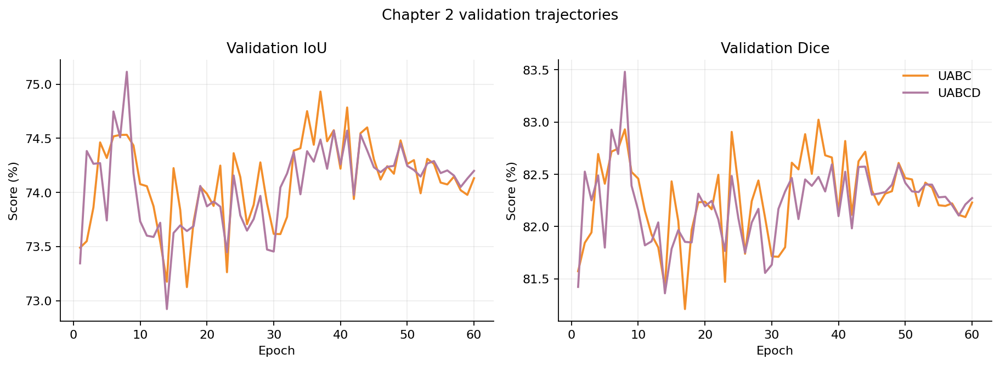
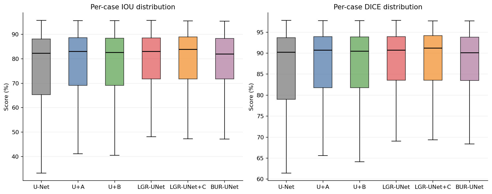
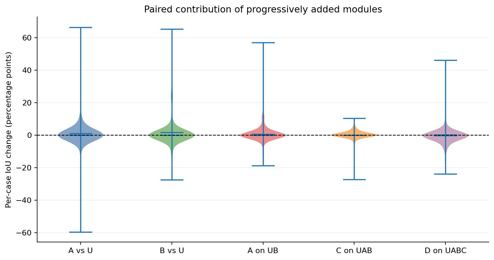
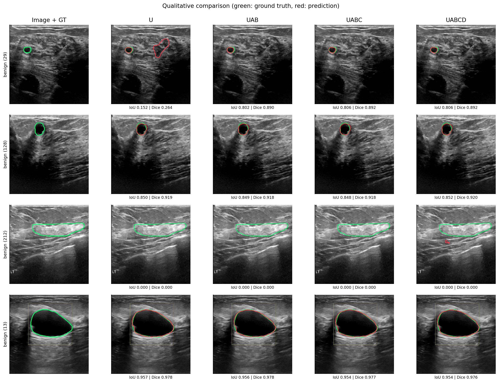
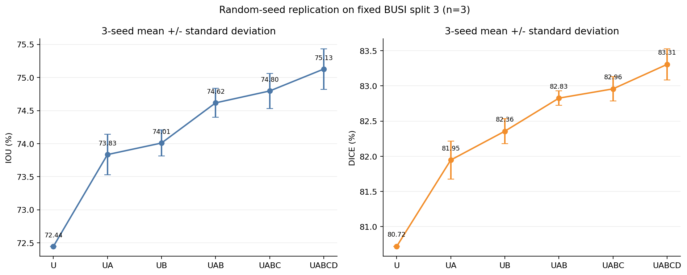
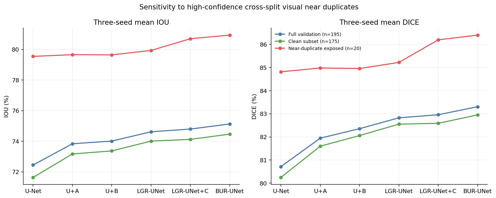

# 硕士学位论文初稿（低专业度版）

**论文题目：** 基于改进 U-Net 的乳腺超声图像分割方法研究<br>
**作者：** [作者姓名]<br>
**学号：** [学号]<br>
**导师：** [导师姓名、职称]<br>
**培养单位：** [学院名称]<br>
**学科专业：** [学科专业]<br>
**提交日期：** [提交日期]

> 版本说明：本版本在不改变模型、实验数据和结论的前提下，使用更接近普通硕士论文的表达方式。本稿依据当前 BUSI split 3 的随机种子 41 主实验以及随机种子 7、73 的完整复现实验形成；三个种子均满足两章内部模型排序，已达到最低三种子复核规模，但尚未扩展至更稳健的五种子，也未完成外部数据集和临床读片实验。涉及统计推断的结论均按现有证据强度表述，不将平均结果提升等同于普适有效性。

# 目录

# 摘要

乳腺超声具有无辐射、成本较低和检查方便等优点，是乳腺疾病检查中常用的影像手段。但超声图像中常有散斑噪声、声影、对比度较低和边界模糊等问题，这些问题会增加自动分割的难度。U-Net 能够融合不同尺度的图像特征，但它对所有图像采用相同的处理方式，对较远区域之间的联系考虑得也不够充分。另外，常用损失函数更关注病灶区域是否重合，对少量边界偏移不够敏感，也不能分别处理漏分和误分。

针对这些问题，本文以 U-Net 为基础，按照由简单到复杂的顺序加入四个模块。模块 A 称为多特征增强模块，它设置三个处理分支，分别关注噪声、小病灶和模糊边界，并根据输入图像自动调整三个分支的权重。模块 B 称为全局关系增强模块，它在网络最深层比较不同特征通道之间的关系，帮助模型从整体上判断病灶位置。在 A 和 B 的基础上，模块 C 使用边界和距离信息进一步修改分割轮廓，因此称为边界细化模块。最后，模块 D 找出模型不太确定的区域，并分别处理漏分和误分，因此称为易错区域修正模块。四个模块形成了“局部特征增强—全局信息补充—边界细化—错误修正”的处理顺序。

为了公平比较各模块，本文使用同一套代码建立 U、UA、UB、UAB、UABC 和 UABCD 六种模型。每次加入新模块时，先把该模块设置为不改变原模型输出的状态，再继续训练。测试表明，相邻阶段在继续训练前的最大输出差为 0。所有实验都使用 BUSI 的 split 3，训练集为 452 例，验证集为 195 例。预测阈值固定为 0.5，并根据每个病例 IoU 的平均值保存最佳模型。

实验结果表明，第一部分中 U-Net、UA、UB 和 UAB 的 IoU 分别为 72.445%、73.622%、74.193% 和 74.847%，Dice 分别为 80.718%、81.817%、82.537% 和 82.943%。UAB 在两项指标上均为第一部分最优，并被命名为 UnetAB。第二部分以同一个 UnetAB 检查点为起点，UABC 和 UABCD 的 IoU 分别为 74.932% 和 75.115%，Dice 分别为 83.022% 和 83.480%，形成 UnetAB < UnetAB+C < UnetAB+C+D 的递进关系。最终模型包含约 11.31M 实际使用参数，在 RTX 4060 Laptop GPU 上处理单张 256×256 图像的平均前向延迟约为 10.03 ms。

进一步分析发现，各模块并不是对每个病例都有效。B 相对 U-Net 的平均 IoU 提高了 1.748 个百分点，其 95% Bootstrap 置信区间为 [0.615, 2.994]；C 和 D 的置信区间仍包含 0，说明它们的提升还不够稳定。使用随机种子 7、41 和 73 重复实验后，模型排序均满足要求，UABCD 的平均 IoU 为 75.128%±0.307%，Dice 为 83.306%±0.223%。数据检查还发现训练集和验证集中有相似图像。去掉受影响的 20 个验证病例后，剩余 175 例上的平均 IoU 和 Dice 分别为 74.464% 和 82.952%，总体排序没有改变，但 C 在个别随机种子下不再带来提升。因此，本文只说明当前方法在固定 split 3 上有效，暂不说明它在其他医院或设备数据上也能取得相同效果。

**关键词：** 乳腺超声；医学图像分割；U-Net；特征增强；边界细化；错误修正

# Abstract

Breast ultrasound is widely used in screening and computer-aided diagnosis because it is radiation-free, inexpensive, and suitable for real-time examination. Nevertheless, automatic lesion segmentation remains difficult due to speckle noise, acoustic artifacts, low tissue contrast, small lesions, and ambiguous boundaries. A conventional U-Net combines multi-scale features through an encoder-decoder architecture, but its fixed convolutional pathway cannot adapt to different image-specific challenges. Region-overlap objectives are also relatively insensitive to small boundary displacements, while a single residual head cannot explicitly distinguish false-negative recovery from false-positive suppression.

This thesis improves U-Net with four modules that are added in sequence. Module A uses three feature branches for noise, small lesions, and unclear boundaries. Module B uses relationships between feature channels to improve the overall lesion prediction. Module C uses boundary and distance information to adjust the contour. Module D locates uncertain areas and uses two branches to correct missed and incorrectly segmented regions. Together, the four modules follow a clear order: local feature enhancement, global information enhancement, boundary refinement, and error correction.

The same implementation is used for six model variants: U, UA, UB, UAB, UABC, and UABCD. When a new module is added, it is initialized so that the output remains unchanged before further training. All experiments use BUSI split 3, which contains 452 training cases and 195 validation cases. The threshold is fixed at 0.5, and the best checkpoint is selected by mean per-case IoU.

In Chapter 1, U, UA, UB, and UAB achieve IoU scores of 72.445%, 73.622%, 74.193%, and 74.847%, and Dice scores of 80.718%, 81.817%, 82.537%, and 82.943%, respectively. UAB is therefore denoted as UnetAB. In Chapter 2, UABC and UABCD further improve IoU to 74.932% and 75.115%, and Dice to 83.022% and 83.480%. Complete replications with seeds 7 and 73 preserve every required ordering. Across seeds 7, 41, and 73, UABCD obtains 75.128% +/- 0.307% IoU and 83.306% +/- 0.223% Dice. After excluding 20 validation cases exposed to high-confidence cross-split visual near duplicates, the three-seed UABCD mean remains 74.464% IoU and 82.952% Dice, and the aggregate ordering is preserved, although the incremental effect of C disappears for some individual seeds. The final model contains 11.31M active parameters and requires approximately 10.03 ms per 256×256 image on an RTX 4060 Laptop GPU. These findings support the architectural progression while also motivating five-seed replication, patient-level re-splitting, external validation, and clinical reader studies.

**Keywords:** breast ultrasound; medical image segmentation; U-Net; feature enhancement; boundary refinement; error correction

# 第1章 绪论

## 1.1 研究背景与意义

乳腺癌是威胁女性健康的重要恶性肿瘤之一。早期发现、准确定位和规范随访能够显著改善患者预后。超声检查对致密型乳腺具有较高实用价值，且便于进行多切面动态观察。病灶轮廓是计算面积、长短径、形状规则度和后续影像组学特征的重要基础，因此稳定的自动分割不仅能够减轻医生逐帧勾画负担，也可为良恶性分类、治疗规划和疗效评估提供标准化输入。

乳腺超声图像与普通自然图像不同，图像中常有明显的散斑噪声。探头压力、扫描角度、设备参数和患者差异也会改变图像外观。有些病灶与周围组织灰度接近，声影会遮住部分边界，小病灶在多次下采样后还可能丢失。因此，模型既要提取局部细节，也要参考整幅图像的信息；在得到大致病灶区域后，还需要继续调整边界并修正漏分和误分。

U-Net 结构清楚、训练方便，是医学图像分割中常用的基础模型。增加注意力、Transformer 或更大的编码器，虽然可能提高模型能力，但在小数据集上不一定更好。前期实验中，ConvNeXt-Tiny U-Net、ResNet101 U-Net 和 384×384 输入方案都没有表现出稳定优势。因此，本文不继续盲目增大网络，而是根据乳腺超声分割中的具体问题，按顺序设计四个较小的改进模块。

## 1.2 需要解决的主要问题

根据乳腺超声图像的特点，本文主要解决以下四个问题：

1. **不同图像需要不同处理。** 散斑噪声、小病灶和模糊边界的特点不同，只使用固定卷积操作很难同时处理好这些情况。
2. **局部信息和整体信息需要配合。** 局部特征能够保留细节，但模型还需要参考不同通道和较远区域的信息，减少错误判断。
3. **病灶边界需要进一步细化。** BCE 和 Dice 主要关注区域重合，对边界内外方向以及像素到轮廓的距离考虑不足。
4. **漏分和误分需要分别修正。** 漏分需要补充病灶区域，误分需要删除错误区域，使用同一个输出分支不容易同时完成两种操作。

## 1.3 国内外研究现状

### 1.3.1 U-Net 及其多尺度改进

Ronneberger 等提出 U-Net 后，UNet++、U-Net 3+、Attention U-Net 和 nnU-Net 分别从密集跳跃连接、全尺度融合、注意力门控和自动配置等角度扩展了基线。TransUNet 与 Swin-Unet 将 Transformer 引入医学分割，以增强全局建模能力。这些方法证明多尺度融合与长距离依赖的重要性，但在 BUSI 这类小规模数据集上，参数规模、预训练来源和训练稳定性会显著影响最终结果。

### 1.3.2 主流对比模型介绍

为了更清楚地说明本文方法与常见分割网络的区别，下面介绍项目中已经实现并报告 BUSI 结果的 11 个模型。它们可以分为传统卷积模型、Transformer 或混合模型，以及轻量化模型三类。

1. **U-Net。** U-Net 采用编码器和解码器结构。编码器逐步提取较深层特征，解码器恢复图像尺寸，同尺度跳跃连接把浅层细节直接送到解码端。它结构简单、容易训练，是本文和多数医学图像分割工作的基础模型[1]。
2. **Attention U-Net。** Attention U-Net 在跳跃连接处加入注意力门。解码器提供的较高层信息用于判断哪些编码特征更重要，从而减弱背景区域的影响。不过，注意力门会增加少量参数和计算量[2]。
3. **U-Net++。** U-Net++ 把原来直接相连的跳跃连接改成多层嵌套连接，并在中间层逐步融合编码和解码特征。它还可以使用深监督帮助不同深度的输出学习，但连接较多，结构比 U-Net 更复杂[3]。
4. **U-Net3+。** U-Net3+ 在每个解码阶段同时接收多个编码层和解码层的特征，使不同尺度的信息能够更充分地融合。这种全尺度连接有利于处理大小不同的目标，但计算量通常较大[4]。
5. **TransUnet。** TransUnet 先使用卷积网络提取局部特征，再使用 Transformer 建立较远位置之间的联系，最后通过 U 形解码器恢复分割图。它兼顾局部和整体信息，但参数量较大，对训练数据和预训练权重也比较敏感[6]。
6. **MedT。** MedT 使用门控轴向注意力，把二维注意力分成水平和垂直两个方向计算，以降低完整自注意力的开销。它还采用整图和局部图块结合的训练方法，同时学习整体位置和局部细节[31]。
7. **SwinUnet。** SwinUnet 使用分层的 Swin Transformer 组成编码器和解码器，并通过移动窗口让相邻窗口之间交换信息。窗口注意力能够控制计算量，但模型在小型医学数据集上的效果容易受到预训练方式和训练设置影响[7]。
8. **UNeXt。** UNeXt 前几层使用卷积，网络较深位置使用基于多层感知机的特征块。它通过通道移动和特征投影学习局部联系，重点是减少参数量和提高推理速度[32]。
9. **CMU-Net。** CMU-Net 面向超声图像设计，使用 ConvMixer 模块扩大特征的有效范围，并在跳跃连接中加入多尺度注意力门。前者用于补充整体信息，后者用于筛选更有用的浅层特征[33]。
10. **CMUNeXt。** CMUNeXt 是轻量卷积网络。它使用大卷积核和倒置瓶颈结构提取较大范围的信息，并通过 Skip-Fusion 模块改善编码器和解码器之间的特征融合[34]。
11. **Mobile U-ViT。** Mobile U-ViT 面向移动设备设计，使用大卷积核卷积块完成分层特征提取，在最深层加入较浅的 Transformer，并采用级联解码器恢复分割结果。该模型在参数量较小的情况下兼顾局部和整体信息，是原项目参考结果中 IoU 和 Dice 最高的模型[35]。

这 11 个模型代表了三条常见改进路线：Attention U-Net、U-Net++ 和 U-Net3+ 主要改进特征融合；TransUnet、MedT 和 SwinUnet 主要增加长距离信息；UNeXt、CMUNeXt 和 Mobile U-ViT 更重视轻量化。本文没有直接替换 U-Net 主干，而是在统一基线上按 A、B、C、D 的顺序解决局部特征、整体关系、边界和易错区域问题。

### 1.3.3 超声图像中的多分支特征处理

传统超声去噪包括中值滤波、各向异性扩散、小波阈值和非局部均值等。深度模型则倾向于在特征域内学习抑噪。固定抑噪可能同时损失小病灶边缘，因此更合理的方式是让模型根据样本内容选择噪声抑制、细节保持或上下文聚合路径。混合分支和动态卷积为此提供了方法基础。Sun 等提出的 CAU-Net 按噪声干扰、小肿瘤和模糊边界设置三个完整编码分支，并通过自适应聚合层融合多尺度特征[21]，证明了“按问题类型分开处理再自适应聚合”在乳腺超声分割中的合理性。本文模块 A 沿用这一问题分解，但将三个完整编码器改为共享 U-Net 主干上的轻量分支，并增加零初始化残差门控，以控制参数量并支持严格的渐进初始化。

### 1.3.4 特征关系计算与全局关系建模

非局部网络、自注意力和图卷积均可突破局部卷积的有限感受野。空间自注意力在高分辨率特征上计算开销较大，而通道图可以将语义通道视为紧凑节点，以较低代价传播互补证据。CAU-Net 已在最深层特征上使用特征关系计算模块建模通道相关性[21]，因此“通道图用于乳腺超声”本身不是本文首创。本文模块 B 的贡献边界是：在同一网络中实现轻量通道关系计算，并把结果以受限制的残差方式加回最深层特征，使其能够与 A 独立消融并逐级继承权重。

### 1.3.5 边界监督、距离场与不确定性

Boundary Loss、Hausdorff 距离损失和距离变换辅助任务表明，显式几何约束能够补充区域损失。Yang 等提出的 PBNet 通过形态学膨胀/腐蚀提取边界并引导多层特征融合，在 BUSI 与院内数据上使用五折交叉验证和多重比较校正[22]。本文模块 C 不复现 PBNet 的 MGPM/BGM，而是联合预测边界与连续有符号距离场，再通过零初始化边界修正量修正区域 logits。

另一方面，MC Dropout、深度集成和预测熵常用于医学图像不确定性评估。Zhang 等在 SF-RecSAM 中提出空间—频率融合和不确定性修正，并显式处理假阳性与假阴性[20]。因此，双向错误修正也不是本文从零提出的概念。本文模块 D 的差异在于：面向纯 CNN 的渐进 U-Net，将预测熵与不同尺度预测之间的差异联合成不确定性门控，并使用相互独立的漏分修正分支和误分修正分支执行有符号残差修正。

### 1.3.6 既有工作与本文创新边界

本文的 A—D 不是对已有模块的简单改名。A、B 吸收 CAU-Net 的按问题类型分开处理与通道图思想，C 受到边界监督、距离场和 PBNet 的启发，D 受到 SF-RecSAM 双错误修正思想的启发；本文的主要工作是把这些思路放入同一个轻量 U-Net 中，并采用可以继承前一级参数、加入新模块时不改变原输出的训练方式，并通过 U、UA、UB、UAB、UABC、UABCD 的固定协议验证每一步增量。相应地，本文不把“三挑战”“通道图”“边界引导”或“假阳性/假阴性双修正”单独宣称为全球首次提出。因此，本文的创新主要体现在具体结构、模块组合方式和逐步训练方法上，不把已有的基本思路说成本文首次提出。近期核心文献的出版元数据、来源链接和设计对应关系记录于 `thesis_artifacts/literature_evidence.json`。

## 1.4 研究内容与技术路线

本文中四个模块采用容易理解的功能名称。为了与程序代码对应，表 1-1 给出论文名称和代码实现的关系。

| 模块 | 论文中的名称 | 主要作用 | 代码中的对应实现 |
|---|---|---|---|
| A | 多特征增强模块 | 分别处理噪声、小病灶和模糊边界特征 | `StableTriChallengeAdapter` |
| B | 全局关系增强模块 | 补充不同特征通道之间的整体联系 | `ChannelGraphReasoning` |
| C | 边界细化模块 | 使用边界和距离信息调整分割轮廓 | `BoundaryDistanceCooperativeHead` |
| D | 易错区域修正模块 | 分别修正容易出错区域中的漏分和误分 | `UncertaintyDrivenDualErrorRefinement` |

本文技术路线如图 1-1 所示。

{#fig:architecture width=100%}

整个方法分为两个阶段。第一阶段先用 U-Net 提取不同尺度的特征，A 根据图像内容对三个特征分支加权，B 再补充不同通道之间的整体联系，得到 UnetAB。第二阶段以 UnetAB 为起点，C 利用边界和距离信息调整轮廓，D 再重点修改模型不确定区域中的漏分和误分。

## 1.5 主要创新点

1. 设计**多特征增强模块 A**。该模块设置噪声、小病灶和边界三个处理分支，并根据输入图像计算分支权重，使网络能够选择更合适的局部特征。
2. 设计**全局关系增强模块 B**。该模块在网络最深层计算不同特征通道之间的关系，再把得到的全局信息加回原特征，用于减少只看局部区域造成的误分。
3. 设计**边界细化模块 C**。该模块同时预测病灶边界和像素到边界的距离，并利用这两类信息调整 UnetAB 的分割轮廓。
4. 设计**易错区域修正模块 D**。该模块结合预测概率和不同尺度输出的差异找到容易出错的区域，再使用两个独立分支分别修正漏分和误分。
5. 建立**逐步训练和对比实验方法**。六种模型使用同一基础结构，每次加入新模块时都先保证输出不变，再继续训练，从而使各阶段的比较更加公平。

## 1.6 论文结构

第 1 章介绍研究背景、现状、科学问题与创新点。第 2 章说明数据集、U-Net 基线、指标、训练协议和数据质量审计。第 3 章研究 A、B 两个特征增强模块并得到 UnetAB。第 4 章研究 C、D 两个细化模块并得到最终 UABCD。第 5 章开展统计、复杂度、可视化、失败实验与局限性分析。第 6 章总结全文并提出未来工作。

# 第2章 理论基础与实验设计

## 2.1 二值分割形式化

设输入超声图像为 $X\in\mathbb{R}^{3\times H\times W}$，真实掩码为 $Y\in\{0,1\}^{H\times W}$。网络输出像素 logits $Z=f_\theta(X)$，前景概率为：

$$P=\sigma(Z)=\frac{1}{1+\exp(-Z)}.$$

固定阈值 $t=0.5$ 后得到预测掩码 $\hat{Y}=\mathbb{I}(P\ge t)$。本文不根据验证集搜索阈值。

## 2.2 U-Net 基线

本文统一基线保持 U-Net 的五级编码、四级解码和同尺度跳跃连接。局部卷积单元采用残差双卷积实现，以改善 100 轮训练中的梯度传播，但不包含 A、B、C、D 中任何模块。设第 $l$ 级编码输出为 $F_l$，解码过程可表示为：

$$D_l=\phi_l\left([F_l,\operatorname{Up}(D_{l+1})]\right),$$

其中 $[\cdot]$ 表示通道拼接，$\phi_l$ 为残差卷积融合单元。最终通过 $1\times1$ 卷积得到分割 logits。

## 2.3 数据集与固定划分

BUSI 数据集由 Al-Dhabyani 等公开。本文按照项目固定 split 3 使用 647 例含病灶图像，其中训练集 452 例，验证集 195 例。多掩码病例在预处理阶段取并集。所有图像缩放到 256×256，训练增强包括随机翻转、旋转、缩放平移、亮度对比度、Gamma、噪声和轻度模糊。

| 集合 | 病例数 | 用途 |
|---|---:|---|
| 训练集 | 452 | 参数优化与数据增强 |
| 验证集 | 195 | 固定阈值评估与逐病例 IoU 选模 |

## 2.4 评价指标

只报告 IoU 和 Dice。对单病例有：

$$\operatorname{IoU}=\frac{TP}{TP+FP+FN},$$

$$\operatorname{Dice}=\frac{2TP}{2TP+FP+FN}.$$

最终值为 195 个病例指标的算术平均，而非先累计所有像素再计算。该口径避免大病灶完全主导结果，更符合逐病例临床评价。

## 2.5 损失函数

基础区域损失由 BCE 与软 Dice 组成：

$$\mathcal{L}_{region}=0.5\mathcal{L}_{BCE}+\left(1-\frac{2\sum_iP_iY_i+\epsilon}{\sum_iP_i+\sum_iY_i+\epsilon}\right).$$

引入 C、D 后，总损失为：

$$\mathcal{L}=\mathcal{L}_{region}+\lambda_c\mathcal{L}_{coarse}+\lambda_b\mathcal{L}_{boundary}+\lambda_d\mathcal{L}_{distance}+\lambda_e\mathcal{L}_{dual}+\lambda_s\mathcal{L}_{deep}.$$

本文采用 $\lambda_c=0.05$、$\lambda_b=0.10$、$\lambda_d=0.10$、$\lambda_e=0.10$、$\lambda_s=0.25$。

## 2.6 渐进训练协议

1. U-Net 基线训练 100 轮并保存最佳检查点。
2. UA 与 UB 均从同一 U 检查点开始，新增模块学习率为 $10^{-4}$，其余参数学习率为 $2\times10^{-5}$，训练 60 轮。
3. UAB 从 UB 最佳检查点开始，仅将新启用 A 置于高学习率组，训练 60 轮。
4. UABC 从 UAB 最佳检查点开始，仅将 C 置于高学习率组，训练 60 轮。
5. UABCD 从 UABC 最佳检查点开始，仅将 D 置于高学习率组，训练 60 轮。

该训练顺序体现“先定位病灶，再调整边界，最后修正错误”的思路。需要指出，渐进模型经历了更多阶段性优化，因此该实验主要证明模块链在渐进学习场景中的有效性；后续仍需补充相同总更新步数的计算预算控制。

## 2.7 数据质量与泄漏审计

审计结果表明，训练集与验证集不存在同名重叠，也不存在字节级完全相同图像，但存在 24 对高置信跨集合近重复图像，共涉及 20 个不同验证病例。近重复图像对应掩码的平均 IoU 为 83.261%，范围为 11.752%—93.912%。这意味着 BUSI 同时存在患者级近重复风险和标注不一致。本文保留固定 split 3 以保证实验连续性，同时增加剔除上述 20 个验证病例的三种子敏感性分析；但该分析仍不能把 split 3 视为经患者身份核验的严格独立划分。

# 第3章 局部与全局特征增强方法

## 3.1 本章研究动机

U-Net 对所有图像使用相同的卷积操作，但不同图像的问题并不相同。噪声较多时需要适当平滑，小病灶需要保留细节，边界模糊时则需要参考更大的周围区域。因此，A 使用三个分支分别处理这三种情况。局部特征增强后，模型还需要从整体上判断这些特征是否属于同一病灶，所以在 A 后加入 B。

## 3.2 模块 A：多特征增强模块

### 3.2.1 三分支结构

对第 $l$ 级输入特征 $F_l$，定义噪声处理分支、小病灶处理分支和边界处理分支：

$$E_l^n=\phi_l^n(\operatorname{AvgPool}_{3\times3}(F_l)),$$

$$E_l^s=\phi_l^s(F_l),$$

$$E_l^b=\phi_l^b(F_l;d=3),$$

其中 $d=3$ 表示膨胀率。噪声处理分支先进行局部均值聚合，小病灶处理分支采用紧凑深度卷积，边界处理分支通过膨胀卷积扩大上下文。

### 3.2.2 分支权重计算

全局池化后由权重计算分支输出三个权重：

$$\boldsymbol{\alpha}_l=\operatorname{Softmax}(g_l(\operatorname{GAP}(F_l))),$$

$$M_l=\alpha_l^nE_l^n+\alpha_l^sE_l^s+\alpha_l^bE_l^b.$$

最终使用零初始化残差进行融合：

$$\tilde{F}_l=F_l+\sigma(s_l)h_l([F_l,M_l]).$$

$h_l$ 的最后一层权重和偏置初始化为零，因此训练开始时 $\tilde{F}_l=F_l$。这使 A 可以无损插入已训练 U-Net。

## 3.3 模块 B：全局关系增强模块

瓶颈特征 $F\in\mathbb{R}^{C\times H\times W}$ 首先降维为 $V\in\mathbb{R}^{C'\times HW}$。归一化后的通道向量构成图节点，邻接矩阵为：

$$A_{ij}=\operatorname{Softmax}_j\left(\frac{\bar{V}_i^T\bar{V}_j}{\sqrt{C'}}\right).$$

关系计算和结果回加过程为：

$$R=AV,\qquad \tilde{F}=F+\tanh(\gamma)W_pR.$$

$\gamma$ 初始化为零，因此，加入 B 时也不会立即改变原模型输出。图构建使用 FP32，避免半精度归一化和批矩阵乘法造成溢出。

## 3.4 第一章实验结果

{#fig:ch1-ablation width=85%}

| 模型 | A | B | IoU/% | Dice/% | 相对 U 的 IoU 增益/百分点 |
|---|:---:|:---:|---:|---:|---:|
| U |  |  | 72.445 | 80.718 | — |
| UA | ✓ |  | 73.622 | 81.817 | +1.177 |
| UB |  | ✓ | 74.193 | 82.537 | +1.748 |
| UAB（UnetAB） | ✓ | ✓ | **74.847** | **82.943** | **+2.402** |

图 3-1 和表 3-1 表明，UA 和 UB 都优于基础 U-Net，UAB 的两项指标最高。A 说明针对噪声、小病灶和边界采用不同处理分支是有帮助的；B 的提升更大，说明整体特征关系对该数据集较重要。在 UB 上继续加入 A 后，IoU 提高 0.655 个百分点，Dice 提高 0.406 个百分点，说明 A 和 B 处理的问题不同，可以配合使用。

{#fig:ch1-curves width=100%}

从训练曲线看，UA 在中后期出现较明显波动，最佳轮次为 33；UB 在第 45 轮达到最佳；UAB 在第 41 轮达到峰值。零初始化保证前几轮没有明显性能下降，但 BUSI 验证集规模有限，单轮波动仍可达到约 1 个百分点，因此必须依靠预先固定的选模规则而不是人工选择展示轮次。

## 3.5 与主流模型的参考对比

原项目在 BUSI 的 647 个病灶病例上比较了 11 个主流模型。参考实验把数据随机划分三次，每次使用 70% 训练、30% 验证，并将图像统一缩放到 256×256。表中的均值和标准差来自这三次随机划分[36]。本文使用固定 split 3，并在同一划分上改变训练随机种子，因此两组结果的数据划分含义不同。为了减少单次结果的偶然性，本节使用 UnetAB 的三随机种子均值进行对照。

| 模型 | 参数量/M | FPS | 计算量（原报告口径） | IoU/% | Dice/% |
|---|---:|---:|---:|---:|---:|
| U-Net | 34.52 | 139.32 | 65.52 GFLOPs | 68.61±2.86 | 76.97±3.10 |
| Attention U-Net | 34.87 | 129.92 | 66.63 GFLOPs | 68.55±3.22 | 76.88±3.50 |
| U-Net++ | 26.90 | 125.50 | 37.62 GFLOPs | 69.49±2.94 | 78.06±3.25 |
| U-Net3+ | 26.97 | 50.60 | 199.74 GFLOPs | 68.38±3.35 | 76.88±3.68 |
| TransUnet | 105.32 | 112.95 | 38.52 GFLOPs | 71.39±2.37 | 79.85±2.59 |
| MedT | 1.37 | 22.97 | 2.40 GFLOPs | 63.36±1.56 | 73.37±1.63 |
| SwinUnet | 27.14 | 392.21 | 5.91 GFLOPs | 54.11±2.29 | 65.46±1.91 |
| UNeXt | 1.47 | 650.48 | 0.58 GFLOPs | 65.04±2.71 | 74.16±2.84 |
| CMU-Net | 49.93 | 93.19 | 91.25 GFLOPs | 71.42±2.65 | 79.49±2.92 |
| CMUNeXt | 3.14 | 471.43 | 7.41 GFLOPs | 71.56±2.43 | 79.86±2.58 |
| Mobile U-ViT | 1.39 | 326.24 | 2.51 GFLOPs | **72.88±2.72** | **81.18±3.05** |
| **UnetAB（本文）** | **11.28** | 约112.2 | 19.42 GMACs | **74.617±0.218** | **82.826±0.103** |

从准确率看，参考模型中 Mobile U-ViT 的结果最高，IoU 为 72.88%，Dice 为 81.18%。UnetAB 的三种子均值比它分别高 1.737 和 1.646 个百分点；随机种子 41 的主实验结果为 74.847% IoU 和 82.943% Dice，对应差值为 1.967 和 1.763 个百分点。由于两组实验不是相同划分，这些差值只能说明结果处于较有竞争力的范围，不能当作严格的显著性结论。

从模型大小看，UnetAB 约有 11.28M 实际使用参数，比参考 U-Net 的 34.52M 少约 67.3%，比 TransUnet 的 105.32M 少约 89.3%。但这一优势部分来自本文采用的轻量 U-Net 基线，不能全部归因于 A 和 B。与 UNeXt、CMUNeXt 和 Mobile U-ViT 相比，UnetAB 的参数量仍明显更大，说明本文更偏向提高分割准确率，而不是追求极限轻量化。

FPS 和计算量也不能直接横向排名。参考表使用 GFLOPs，本文复杂度脚本报告 GMACs；参考模型的测试硬件没有在当前文稿中统一，而本文速度来自 RTX 4060 Laptop GPU。它们可以帮助了解大致开销，但不能据此认定某个模型在同一设备上更快。较可靠的章内结论仍来自同一协议下的消融实验，即 UAB 同时优于 U、UA 和 UB。

## 3.6 配对统计分析

UA 相对 U 的平均逐病例 IoU 增益为 1.177 个百分点，Bootstrap 95% 置信区间为 [-0.111, 2.509]；100 例提高、93 例下降。UB 相对 U 的增益为 1.748 个百分点，置信区间为 [0.615, 2.994]，103 例提高、89 例下降。UAB 相对 UB 的增益为 0.655 个百分点，置信区间为 [-0.064, 1.502]，99 例提高、93 例下降。

结果说明 B 在不同病例上的提升相对更稳定，而 A 的效果更容易受到病例类型影响；A 加入 B 后总体均值达到本章最高，但单病例增益区间仍跨零。种子 7、73 的完整复现实验同样得到 UAB 为本章最优；三个种子达到最低复核规模，但仍共享同一固定划分，因此“对总体病例分布稳定有效”的结论仍需五种子复核和患者级独立划分支持。

## 3.7 本章小结

本章先使用 A 处理噪声、小病灶和模糊边界等局部问题，再使用 B 补充整体特征关系。实验中 UAB 的 IoU 和 Dice 均为本章最高，因此将其命名为 UnetAB，并作为下一章的基础模型。

# 第4章 边界与错误区域细化方法

## 4.1 本章研究动机

UnetAB 已经能够找到大部分病灶区域，但对边界位置考虑得还不够细。对于小病灶，边界只偏移几个像素也会明显影响 IoU。此外，边界调整后仍可能出现漏分和误分。为此，本章先用 C 根据边界和距离信息调整轮廓，再用 D 找出不确定区域并分别修正两类错误。

## 4.2 模块 C：边界细化模块

### 4.2.1 边界目标

真实边界由膨胀与腐蚀之差得到：

$$Y_b=\operatorname{Dilate}(Y)-\operatorname{Erode}(Y).$$

边界 BCE 对真实边界像素赋予更高权重，并利用粗分割熵进一步强调模糊区域。

### 4.2.2 有符号距离场

定义归一化有符号距离：

$$Y_d(p)=\frac{d(p,\partial Y)}{\max_q|d(q,\partial Y)|}\begin{cases}+1,&p\in Y\\-1,&p\notin Y.\end{cases}$$

距离分支使用 Smooth L1 损失，使网络能够判断像素位于病灶内部还是外部，并学习像素到边界的距离。

### 4.2.3 分割结果修正

将解码特征、边界概率和距离预测拼接后生成修正量：

$$Z_C=Z_{AB}+\sigma(s_C)h_C([D_0,\sigma(B),S]).$$

$h_C$ 的输出层零初始化，因此 UABC 的初始分割与 UnetAB 完全一致。

## 4.3 模块 D：易错区域修正模块

### 4.3.1 不确定性估计

粗分割熵为：

$$H(P)=-P\log P-(1-P)\log(1-P).$$

将主输出与多尺度辅助输出上采样后计算标准差 $V(P)$，最终不确定性为：

$$U=\operatorname{clip}(0.7H(P)+0.3V(P),0,1).$$

熵表示主输出是否确定，标准差表示不同尺度的预测是否一致。两者结合后，可以更全面地找出容易出错的区域。

### 4.3.2 漏分和误分修正

模块 D 分别预测漏分响应 $R_{FN}$ 和误分响应 $R_{FP}$：

$$Z_D=Z_C+\eta U\left(\sigma(R_{FN})-\sigma(R_{FP})\right).$$

其中，$R_{FN}$ 用于补充漏掉的病灶区域，$R_{FP}$ 用于删除错误预测的前景区域。两个输出头均零初始化，使初始差值为零。

## 4.4 第二章实验结果

{#fig:ch2-ablation width=80%}

| 模型 | C | D | IoU/% | Dice/% | 相对前级 IoU 增益/百分点 |
|---|:---:|:---:|---:|---:|---:|
| UnetAB |  |  | 74.847 | 82.943 | — |
| UnetAB+C | ✓ |  | 74.932 | 83.022 | +0.085 |
| UnetAB+C+D | ✓ | ✓ | **75.115** | **83.480** | **+0.183** |

结果满足 $UnetAB<UnetAB+C<UnetAB+C+D$，最终模型在 IoU 和 Dice 上均为第二章最优。C 带来的平均增益较小，表明 UnetAB 已完成主要区域定位，C 主要对边界像素进行微调。D 的 Dice 增益大于 IoU 增益，说明其对预测区域整体重合程度具有更明显影响。

{#fig:ch2-curves width=100%}

UABC 在第 37 轮达到最佳，UABCD 在第 8 轮达到最佳。D 的最优点出现较早，随后验证性能下降，说明误差纠正分支学习速度快于基础语义网络，且继续联合优化可能过拟合少数不确定区域。后续可采用阶段冻结、更小的 D 学习率或提前设定的早停规则。

## 4.5 与主流模型的参考对比

第二章使用同一组主流模型参考结果，并将比较对象改为最终模型 UABCD。为与参考表中的“均值±标准差”形式接近，本文仍报告随机种子 7、41 和 73 在固定 split 3 上的均值与标准差。需要再次说明，参考模型的标准差来自三次随机数据划分，本文的标准差来自同一划分上的三次训练，两者不能解释为完全相同的实验。

| 模型 | 参数量/M | FPS | 计算量（原报告口径） | IoU/% | Dice/% |
|---|---:|---:|---:|---:|---:|
| U-Net | 34.52 | 139.32 | 65.52 GFLOPs | 68.61±2.86 | 76.97±3.10 |
| Attention U-Net | 34.87 | 129.92 | 66.63 GFLOPs | 68.55±3.22 | 76.88±3.50 |
| U-Net++ | 26.90 | 125.50 | 37.62 GFLOPs | 69.49±2.94 | 78.06±3.25 |
| U-Net3+ | 26.97 | 50.60 | 199.74 GFLOPs | 68.38±3.35 | 76.88±3.68 |
| TransUnet | 105.32 | 112.95 | 38.52 GFLOPs | 71.39±2.37 | 79.85±2.59 |
| MedT | 1.37 | 22.97 | 2.40 GFLOPs | 63.36±1.56 | 73.37±1.63 |
| SwinUnet | 27.14 | 392.21 | 5.91 GFLOPs | 54.11±2.29 | 65.46±1.91 |
| UNeXt | 1.47 | 650.48 | 0.58 GFLOPs | 65.04±2.71 | 74.16±2.84 |
| CMU-Net | 49.93 | 93.19 | 91.25 GFLOPs | 71.42±2.65 | 79.49±2.92 |
| CMUNeXt | 3.14 | 471.43 | 7.41 GFLOPs | 71.56±2.43 | 79.86±2.58 |
| Mobile U-ViT | 1.39 | 326.24 | 2.51 GFLOPs | **72.88±2.72** | **81.18±3.05** |
| **UABCD（本文）** | **11.31** | 约99.7 | 21.40 GMACs | **75.128±0.307** | **83.306±0.223** |

UABCD 的三种子 IoU 和 Dice 比参考结果最高的 Mobile U-ViT 分别高 2.248 和 2.126 个百分点，比 CMUNeXt 分别高 3.568 和 3.446 个百分点。随机种子 41 的主实验为 75.115% IoU 和 83.480% Dice，整体最佳的 seed 73 模型达到 75.442% IoU 和 83.382% Dice。这些结果说明最终模型在当前 BUSI 实验中具有较好的分割表现，但仍不能替代同一划分、同一训练轮数和同一硬件下的重新训练比较。

与第一章的 UnetAB 相比，加入 C 和 D 后，三种子平均 IoU 从 74.617% 提高到 75.128%，Dice 从 82.826% 提高到 83.306%，对应提升为 0.511 和 0.480 个百分点。模型参数量只增加约 0.03M，但计算量从 19.42 GMACs 增加到 21.40 GMACs，单张延迟从 8.91 ms 增加到 10.03 ms。这说明 C 和 D 的参数开销较小，但全分辨率边界分支和多尺度辅助输出会增加一定计算时间。

轻量模型仍有明显的部署优势。Mobile U-ViT 只有 1.39M 参数，UNeXt 和 CMUNeXt 的参考 FPS 也明显更高。UABCD 更适合作为重视分割质量的研究模型；如果后续需要在移动设备或超声仪器上运行，还需要使用通道裁剪、知识蒸馏或轻量主干进一步压缩。综合来看，本章的主要结论是 C 和 D 在较小参数增量下继续提高了 UnetAB，而不是宣称最终模型在所有速度和资源指标上都优于主流方法。

## 4.6 逐病例增益与统计解释

{#fig:case-distribution width=100%}

{#fig:paired-delta width=90%}

UABC 相对 UAB 的平均 IoU 增益为 0.085 个百分点，111 例改善、82 例下降；尽管均值置信区间跨零，其单侧 Wilcoxon 检验反映多数小幅正向变化。UABCD 相对 UABC 的平均 IoU 增益为 0.183 个百分点，但仅 85 例改善、108 例下降，单侧 Wilcoxon 检验不支持“多数病例提升”。这意味着 D 的均值收益主要由少数大幅修正病例贡献，而不是所有病例一致变好。

D 的目标是只重点修改模型不确定的区域，已经分对的区域应尽量保持不变。实际结果表明，D 能提高验证集平均指标，但也会让一部分病例略有下降。因此，本文只说明 D 在当前固定验证集上提高了平均结果，不认为它对所有病例都有效。

## 4.7 定性结果

{#fig:qualitative width=100%}

图 4-5 第一行病例中，基础 U-Net 在真实小病灶之外产生大面积远端假阳性，UnetAB 成功删除该区域，说明 A+B 对整体判断能力的改善具有直观意义。第二行展示高质量稳定病例，四个阶段均能准确勾画低回声病灶，C+D 只进行轻微边界调整。第三行病例在所有模型中均完全漏检，反映当前框架对部分高回声、低对比或标注异常病例仍缺乏召回能力。第四行病例的 IoU 超过 95%，说明模型在边界清晰、形态规则病灶上已接近标注轮廓。

## 4.8 本章小结

本章在 UnetAB 上依次加入 C 和 D。C 负责调整边界，D 负责修正不确定区域。IoU 和 Dice 均按照 UnetAB、UABC、UABCD 的顺序提高，因此 UABCD 是本章的最终模型。不过，逐病例结果说明 C 和 D 的提升还不够稳定，后续仍需继续改进。

# 第5章 综合实验与讨论

## 5.1 模型复杂度

| 模型 | 实际使用参数/M | 256×256 GMACs | 单张延迟/ms |
|---|---:|---:|---:|
| U | 8.985 | 17.155 | 5.38 |
| UA | 11.210 | 19.400 | 8.80 |
| UB | 9.052 | 17.173 | 5.35 |
| UAB | 11.277 | 19.417 | 8.91 |
| UABC | 11.287 | 20.074 | 9.26 |
| UABCD | 11.307 | 21.399 | 10.03 |

B 仅增加约 0.067M 参数，几乎不增加延迟，却产生第一章最稳定的独立增益。A 增加约 2.225M 参数和 3.4 ms 延迟，是主要额外开销。C、D 合计仅增加约 0.030M 参数，但由于全分辨率分支和多尺度辅助预测，计算量增加约 1.98 GMACs。最终模型仍可达到约 99 次/秒的理论单张前向速度，具备接近实时应用的潜力。这里的延迟不包含磁盘读取、预处理和可视化。

## 5.2 与替代主干和失败路线的比较

前期实验系统测试了更大或更新的编码器。ConvNeXt-Tiny U-Net 的 IoU/Dice 为 76.793%/84.744%，ResNet101 U-Net 为 77.149%/84.817%，说明使用自然图像预训练的主干可以提高指标，但不能直接说明 A—D 四个模块分别带来了多少提升。整图 384×384 且冻结编码器 BN 的 ResNet50 实验仅达到 75.614%/83.605%，说明直接提高输入分辨率会造成尺度偏移。水平翻转测试时增强与最大连通域后处理均造成下降，表明模型错误不是简单的离散噪点问题。

此外，早期 C、D 从随机初始化训练时均未超过控制组；只有先得到较稳定的 UnetAB，并采用加入模块时保持原输出不变的训练方法，C 和 D 才取得正向结果。这说明边界调整和错误修正需要建立在较准确的病灶定位结果上，四个模块的加入顺序有实际依据。

## 5.3 随机种子复现实验

为检验排序是否仅由随机种子 41 偶然产生，本文在完全相同的 BUSI split 3、阈值 0.5、图像尺寸、损失和每阶段 60 epoch 协议下，以随机种子 7、73 重复 UA、UB、UAB、UABC 和 UABCD 的全部训练与独立评估。U-Net 起点保持相同，随机种子改变数据打乱、增强采样和新增参数的优化轨迹。训练脚本在 epoch 0 先评估并保存不改变原输出的模型，保证后续微调若全程退化不会错误丢弃前级检查点。

| 模型 | 三种子 IoU（均值±标准差） | 三种子 Dice（均值±标准差） |
|---|---:|---:|
| U | 72.445±0.000 | 80.718±0.000 |
| UA | 73.835±0.306 | 81.947±0.269 |
| UB | 74.009±0.197 | 82.356±0.178 |
| UAB / UnetAB | 74.617±0.218 | 82.826±0.103 |
| UABC | 74.797±0.265 | 82.958±0.172 |
| UABCD | **75.128±0.307** | **83.306±0.223** |

{#fig:multiseed width=94%}

三个完整种子分别通过四项排序检查：第一章 UAB 的 IoU、Dice 均高于 U、UA、UB；第二章满足 UAB<UABC<UABCD 的 IoU、Dice 严格递增。C 的三种子平均增益为 IoU 0.180 和 Dice 0.132 个百分点，仍是整条链中增益最小的一步；D 的平均增益扩大到 IoU 0.331 和 Dice 0.348 个百分点。三种子结果达到最低复核规模并增强了“排序可复现”的证据，但仍不足以替代五种子实验、独立患者划分或外部验证。

### 5.3.1 去近重复验证敏感性分析

为评估排序是否由跨集合视觉近重复病例驱动，本文依据感知哈希距离不超过 4 且 64×64 归一化缩略图相关系数不低于 0.98 的预设规则，识别 24 对高置信跨集合近重复图像，并从验证统计中剔除涉及的 20 个不同病例。该操作不改变训练集、不重新训练模型、不调整阈值，只在原 195 例验证集之外形成 175 例 去重后的敏感性子集。

| 模型 | 完整集 IoU/Dice（%） | 去重子集 IoU/Dice（%） | 近重复暴露子集 IoU/Dice（%） |
|---|---:|---:|---:|
| U | 72.445 / 80.718 | 71.634 / 80.250 | 79.542 / 84.814 |
| UA | 73.835 / 81.947 | 73.169 / 81.600 | 79.655 / 84.976 |
| UB | 74.009 / 82.356 | 73.366 / 82.059 | 79.641 / 84.955 |
| UAB | 74.617 / 82.826 | 74.009 / 82.553 | 79.931 / 85.220 |
| UABC | 74.797 / 82.958 | 74.122 / 82.588 | 80.696 / 86.193 |
| UABCD | **75.128 / 83.306** | **74.464 / 82.952** | **80.935 / 86.399** |

{#fig:deduplicated-sensitivity width=96%}

三种子均值在完整集、去重子集和近重复暴露子集上均满足第一章 UAB 最优以及第二章 UAB<UABC<UABCD 的 IoU、Dice 严格排序，说明总体递进关系并非仅由近重复病例产生。然而，近重复暴露子集明显更容易：U-Net 的 IoU 比去重子集高 7.908 个百分点，UABCD 高 6.471 个百分点；完整验证集的绝对值因此可能受到一定乐观偏移。更重要的是，逐种子检查显示 seed 7 的 UABC 在去重子集上相对 UAB 的 IoU、Dice 均轻微下降，seed 41 的 UABC Dice 也轻微下降，只有 seed 73 完整保序。这一反例进一步确认 C 是最不稳定的增量模块。故本文只将该结果解释为“三种子平均排序对近重复剔除仍能保持”，不将其替代患者级重新划分和重新训练。

## 5.4 统计效应与实际效应

本文区分三类“有效”：

1. **排序有效：** 预先规定的聚合 IoU、Dice 排序成立。当前两章均满足。
2. **病例分布有效：** 配对检验和置信区间支持多数病例受益。B 相对 U 的证据较强，A、C、D 较弱。
3. **在外部数据上的表现有效：** 在患者级独立外部数据和多设备场景中保持收益。当前尚未验证。

这种分层表述避免将单次最优结果扩大为临床普适结论。本文已完成三个随机种子并报告均值与标准差；硕士论文终稿仍应扩展至五个种子，对每个模型使用相同总更新步数，并在基于患者身份重建的划分和外部数据集上重复验证。

## 5.5 数据标注上限与误差来源

近重复图像间掩码 IoU 最低仅 11.752%，说明同质图像可能对应差异很大的轮廓。此类标签噪声会同时影响模型训练、验证排序和统计检验。完全漏检病例可能来自以下因素：

- 病灶回声与周围组织高度相似；
- 图像包含多个疑似区域，而标注只覆盖一个目标；
- 近重复图像标注标准不一致；
- 缩放到 256×256 后小病灶结构损失；
- 模型训练集缺少相似困难模式。

未来应由至少两名高年资超声医师独立复核困难病例，使用 STAPLE 或共识标注构建更可靠金标准，并将标注者间差异纳入不确定性建模。

## 5.6 临床转化讨论

模型输出不能直接替代临床诊断。合理应用方式包括：自动生成初始轮廓供医生修订、批量计算病灶尺寸、辅助随访同一病灶的变化，以及为分类模型提供标准化 ROI。易错区域修正模块 的不确定性图可进一步作为人工复核提示，但其校准性尚未通过期望校准误差或决策曲线验证。

临床部署还需考虑设备不同设备和数据来源造成的差异、灰度动态范围、探头频率、隐私保护、失败检测和推理可追溯性。对完全漏检病例，系统必须具备拒绝机制，而不能仅输出空掩码。

## 5.7 研究局限性

1. 当前核心递进实验只使用 BUSI split 3；虽已完成随机种子 7、41、73 的复核，但三个种子对训练方差的估计仍较粗糙。
2. 数据划分不是经过患者标识核验的患者级独立划分；去除 20 个近重复暴露验证病例后，三种子均值保持排序，但个别种子的 C 增益消失。
3. 渐进模型经历更多优化阶段，尚缺少严格相同总计算预算控制。
4. C、D 的增益较小，Bootstrap 区间跨零；D 在多数病例上并非正向变化。
5. 未在 Dataset B、UDIAT、私有多中心数据或视频序列上外部验证。
6. 未开展医生读片、轮廓修订时间和临床决策获益实验。
7. 当前论文初稿的文献综述需在正式提交前按学校格式进一步扩充并逐条核验元数据。

## 5.8 可复现性

代码、BUSI 预处理数据、固定划分、训练脚本、评估脚本和最佳阶段结果保存在项目仓库中。模型只使用固定 0.5 阈值，选模依据为逐病例平均 IoU。核心训练入口为 `train_thesis_stages.py`，评估入口为 `evaluate_thesis_stages.py`，制图入口为 `generate_thesis_artifacts.py`，复杂度入口为 `benchmark_thesis_models.py`。`reproducibility_manifest.py` 对 split 文件、647 例图像与掩码、六个阶段权重和评估配置生成 SHA-256 清单，以便发现数据或模型被无意替换；该清单只证明当前本地产物完整性，不替代多随机种子和外部验证。

# 第6章 总结与展望

## 6.1 全文总结

本文以 U-Net 为基础，依次加入四个功能明确的模块。A 根据图像情况组合三种局部特征，B 补充全局特征关系，二者共同组成 UnetAB。在此基础上，C 使用边界和距离信息调整轮廓，D 重点修正不确定区域中的漏分和误分，最终得到 UABCD。

统一 split 3 实验表明，第一章 U、UA、UB、UAB 的 IoU 为 72.445%、73.622%、74.193%、74.847%，Dice 为 80.718%、81.817%、82.537%、82.943%；第二章 UAB、UABC、UABCD 的 IoU 为 74.847%、74.932%、75.115%，Dice 为 82.943%、83.022%、83.480%。因此，当前实验已经满足两章预设的严格排序关系。

本文的另一项重要结论是：模型平均结果排序成立并不意味着模块在所有病例上稳定有效。逐病例统计、置信区间和失败案例揭示了收益差异，尤其是 D 的均值提升主要来自部分大幅修正病例。该发现为后续研究提供了比单一排行榜数值更具体的问题定义。

## 6.2 未来工作

1. **扩展多随机种子与等预算验证。** 当前已完成 3 个种子；终稿应扩展至 5 个种子，对全部变体执行相同总更新步数，采用分层 Bootstrap 或混合效应模型分析模块贡献。
2. **患者级去重与外部验证。** 基于患者身份重建划分，并在 UDIAT、Dataset B 和多中心私有数据上验证。
3. **局部高分辨率级联。** 使用粗分割定位 ROI，再对局部区域进行高分辨率细化，避免整图尺度偏移。
4. **不确定性校准。** 引入温度缩放、深度集成或证据学习，验证不确定性与真实错误的相关性。
5. **拓扑与多病灶建模。** 对完全漏检、多病灶和断裂轮廓设计存在性检测与拓扑约束。
6. **临床人机协同。** 评价自动轮廓对医生修订时间、重复性和诊断决策的真实影响。

# 参考文献

[1] Ronneberger O, Fischer P, Brox T. U-Net: Convolutional Networks for Biomedical Image Segmentation. MICCAI, 2015.

[2] Oktay O, Schlemper J, Folgoc L L, et al. Attention U-Net: Learning Where to Look for the Pancreas. arXiv:1804.03999, 2018.

[3] Zhou Z, Rahman Siddiquee M M, Tajbakhsh N, Liang J. UNet++: A Nested U-Net Architecture for Medical Image Segmentation. DLMIA, 2018.

[4] Huang H, Lin L, Tong R, et al. UNet 3+: A Full-Scale Connected UNet for Medical Image Segmentation. ICASSP, 2020.

[5] Isensee F, Jaeger P F, Kohl S A A, Petersen J, Maier-Hein K H. nnU-Net: a self-configuring method for deep learning-based biomedical image segmentation. Nature Methods, 2021, 18: 203-211.

[6] Chen J, Lu Y, Yu Q, et al. TransUNet: Transformers Make Strong Encoders for Medical Image Segmentation. arXiv:2102.04306, 2021.

[7] Cao H, Wang Y, Chen J, et al. Swin-Unet: Unet-like Pure Transformer for Medical Image Segmentation. ECCV Workshops, 2022.

[8] Al-Dhabyani W, Gomaa M, Khaled H, Fahmy A. Dataset of breast ultrasound images. Data in Brief, 2020, 28: 104863.

[9] Hu J, Shen L, Sun G. Squeeze-and-Excitation Networks. CVPR, 2018.

[10] Woo S, Park J, Lee J Y, Kweon I S. CBAM: Convolutional Block Attention Module. ECCV, 2018.

[11] Wang X, Girshick R, Gupta A, He K. Non-local Neural Networks. CVPR, 2018.

[12] Kipf T N, Welling M. Semi-Supervised Classification with Graph Convolutional Networks. ICLR, 2017.

[13] Kervadec H, Bouchtiba J, Desrosiers C, et al. Boundary Loss for Highly Unbalanced Segmentation. MIDL, 2019.

[14] Karimi D, Salcudean S E. Reducing the Hausdorff Distance in Medical Image Segmentation with Convolutional Neural Networks. IEEE Transactions on Medical Imaging, 2020, 39(2): 499-513.

[15] Gal Y, Ghahramani Z. Dropout as a Bayesian Approximation: Representing Model Uncertainty in Deep Learning. ICML, 2016.

[16] Lakshminarayanan B, Pritzel A, Blundell C. Simple and Scalable Predictive Uncertainty Estimation using Deep Ensembles. NeurIPS, 2017.

[17] Kendall A, Gal Y. What Uncertainties Do We Need in Bayesian Deep Learning for Computer Vision? NeurIPS, 2017.

[18] Kirillov A, Mintun E, Ravi N, et al. Segment Anything. ICCV, 2023.

[19] Ma J, He Y, Li F, et al. Segment anything in medical images. Nature Communications, 2024, 15: 654.

[20] Zhang W, Wu H, Qin J. Domesticating SAM for Breast Ultrasound Image Segmentation via Spatial-Frequency Fusion and Uncertainty Correction. European Conference on Computer Vision, 2024: 20-37. DOI: 10.1007/978-3-031-73337-6_2.

[21] Sun D, Dong C, Yan Y, Jiang B, Duan Y, Tu Z, Zhang C. Challenge-aware U-net for breast lesion segmentation in ultrasound images. Pattern Recognition, 2025, 168: 111851. DOI: 10.1016/j.patcog.2025.111851.

[22] Yang X, Zhang J, Ou Y, Chen Q, Wang L, Wang L. Multilevel perception boundary-guided network for breast lesion segmentation in ultrasound images. Medical Physics, 2025, 52(5): 3117-3134. DOI: 10.1002/mp.17647.

[23] Pawłowska A, Karwat P, Żołek N. Letter to the Editor. Re: “Dataset of breast ultrasound images by W. Al-Dhabyani, M. Gomaa, H. Khaled & A. Fahmy, Data in Brief, 2020, 28, 104863”. Data in Brief, 2023, 48: 109247. DOI: 10.1016/j.dib.2023.109247.

[24] Loshchilov I, Hutter F. Decoupled Weight Decay Regularization. ICLR, 2019.

[25] Lin T Y, Goyal P, Girshick R, He K, Dollar P. Focal Loss for Dense Object Detection. ICCV, 2017.

[26] Milletari F, Navab N, Ahmadi S A. V-Net: Fully Convolutional Neural Networks for Volumetric Medical Image Segmentation. 3DV, 2016.

[27] Sudre C H, Li W, Vercauteren T, Ourselin S, Cardoso M J. Generalised Dice Overlap as a Deep Learning Loss Function for Highly Unbalanced Segmentations. DLMIA, 2017.

[28] Efron B, Tibshirani R J. An Introduction to the Bootstrap. Chapman & Hall/CRC, 1993.

[29] Wilcoxon F. Individual Comparisons by Ranking Methods. Biometrics Bulletin, 1945, 1(6): 80-83.

[30] Lundberg S M, Lee S I. A Unified Approach to Interpreting Model Predictions. NeurIPS, 2017.

[31] Valanarasu J M J, Oza P, Hacihaliloglu I, Patel V M. Medical Transformer: Gated Axial-Attention for Medical Image Segmentation. MICCAI, 2021. arXiv:2102.10662.

[32] Valanarasu J M J, Patel V M. UNeXt: MLP-based Rapid Medical Image Segmentation Network. arXiv:2203.04967, 2022.

[33] Tang F, Wang L, Ning C, Xian M, Ding J. CMU-Net: A Strong ConvMixer-based Medical Ultrasound Image Segmentation Network. IEEE ISBI, 2023. DOI: 10.1109/ISBI53787.2023.10230609.

[34] Tang F, Ding J, Wang L, Ning C, Zhou S K. CMUNeXt: An Efficient Medical Image Segmentation Network based on Large Kernel and Skip Fusion. arXiv:2308.01239, 2023.

[35] Tang F, Nian B, Ding J, et al. Mobile U-ViT: Revisiting Large Kernel and U-shaped ViT for Efficient Medical Image Segmentation. ACM Multimedia, 2025. arXiv:2508.01064.

[36] Tang F. Medical-Image-Segmentation-Benchmarks: Results on BUSI [EB/OL]. GitHub, 2026-07-14. https://github.com/FengheTan9/Medical-Image-Segmentation-Benchmarks.

# 附录 A 关键复现实验命令

```powershell
# 第一章：UA
E:\anaconda3\envs\my_pytorch\python.exe train_thesis_stages.py `
  --variant UA `
  --init_checkpoint .\runs\busi_opt_ch1\screen100_A0\best_model.pth `
  --new_module A `
  --output_dir .\runs\thesis_ch1\UA_seed41_e60 `
  --epochs 60 --seed 41

# 第一章：UB
E:\anaconda3\envs\my_pytorch\python.exe train_thesis_stages.py `
  --variant UB `
  --init_checkpoint .\runs\busi_opt_ch1\screen100_A0\best_model.pth `
  --new_module B `
  --output_dir .\runs\thesis_ch1\UB_seed41_e60 `
  --epochs 60 --seed 41

# 第一章：UAB / UnetAB
E:\anaconda3\envs\my_pytorch\python.exe train_thesis_stages.py `
  --variant UAB `
  --init_checkpoint .\runs\thesis_ch1\UB_seed41_e60\best_model.pth `
  --new_module A `
  --output_dir .\runs\thesis_ch1\UAB_seed41_e60 `
  --epochs 60 --seed 41

# 第二章：UABC
E:\anaconda3\envs\my_pytorch\python.exe train_thesis_stages.py `
  --variant UABC `
  --init_checkpoint .\runs\thesis_ch1\UAB_seed41_e60\best_model.pth `
  --new_module C `
  --output_dir .\runs\thesis_ch2\UABC_seed41_e60 `
  --epochs 60 --seed 41

# 第二章：UABCD
E:\anaconda3\envs\my_pytorch\python.exe train_thesis_stages.py `
  --variant UABCD `
  --init_checkpoint .\runs\thesis_ch2\UABC_seed41_e60\best_model.pth `
  --new_module D `
  --output_dir .\runs\thesis_ch2\UABCD_seed41_e60 `
  --epochs 60 --seed 41
```

# 附录 B 完成度与待补实验

| 项目 | 当前状态 | 终稿前要求 |
|---|---|---|
| 两章递进模型排序 | 已完成 | 多种子复核 |
| 随机种子复核 | 已完成 3 个种子 | 扩展至 5 个种子 |
| 零差异渐进初始化 | 已完成 | 保留单元测试 |
| split 3 独立评估 | 已完成 | 患者级去重划分 |
| 去近重复敏感性分析 | 已完成三种子、175 例 去重子集 | 基于患者身份重新划分并训练 |
| 训练曲线与定性图 | 已完成 | 增加外部数据图 |
| Bootstrap 与 Wilcoxon | 已完成 | 多种子层级统计 |
| 模型复杂度与延迟 | 已完成 | 不同 GPU/CPU 测试 |
| 外部数据集 | 未完成 | 至少一个公开外部集 |
| 医生读片实验 | 未完成 | 伦理审批后开展 |
| 近期核心文献元数据 | 已核验 4 篇 | 全部参考文献按学校模板逐条复核 |
